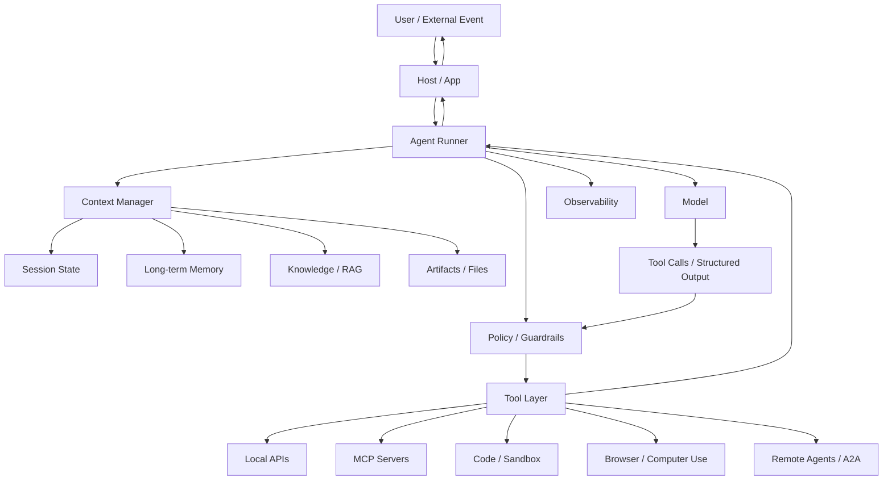
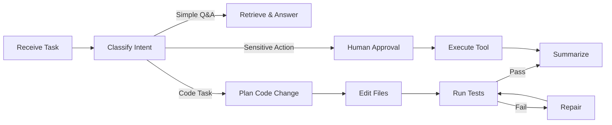
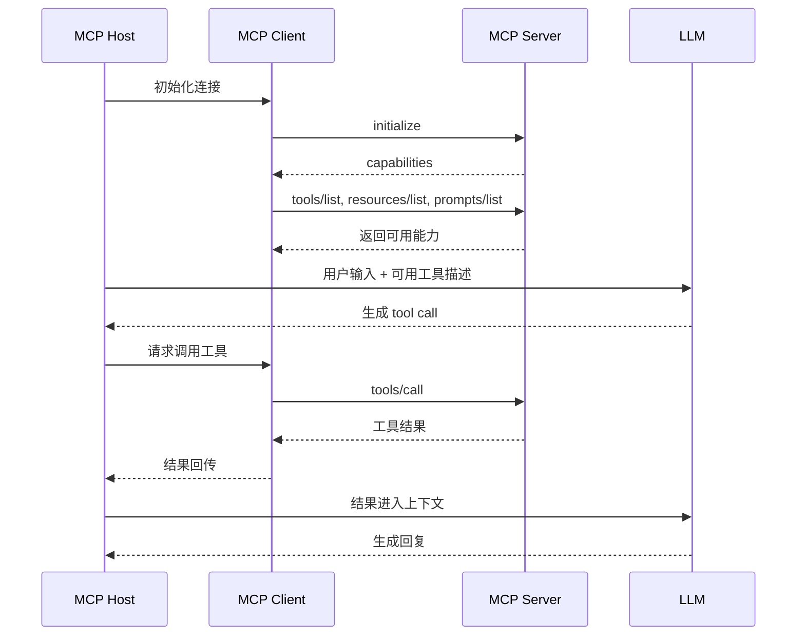

+++
date = '2026-03-09T21:18:26+08:00'
lastmod = '2026-07-18T00:00:00+08:00'
draft = false
title = 'Agent'
tags = ['Agent']
+++

# Agent：从 Prompt Pattern 到 Agent Runtime

如果用 2023 年的视角看 Agent，经典结构通常是 **Planning、Memory、Tools**。这个划分没有错，但放到 2026 年已经不够了。

今天更准确的理解是：

> Agent 不是“一个会调用工具的大模型”，而是一个由模型驱动、可以感知上下文、调用工具、维护状态、接受约束、可观测、可恢复的运行时系统。

可以把现代 Agent 拆成七个部分：

| 层次 | 负责什么 |
|---|---|
| Model | 推理、生成、工具选择、结构化输出 |
| Instructions | 角色、目标、边界、业务规则 |
| Context | 当前任务、历史状态、检索结果、用户偏好、文件和工件 |
| Tools | 函数、API、数据库、代码执行、浏览器、MCP Server、其他 Agent |
| Runtime | 循环调度、流式输出、重试、暂停恢复、并发、检查点 |
| Policy | 权限、审批、沙箱、预算、速率限制、输入输出校验 |
| Observability | trace、评测、日志、成本、延迟、失败分析 |

这也是为什么早期的 Prompt Pattern 文章会显得“旧”：它们解释了 Agent 的思想来源，但没有覆盖生产系统真正困难的部分。

## 1. 经典结构仍然成立，但只能算基础层


经典 Agent 通常被拆成三块：

- **Planning**：把复杂目标拆成步骤。
- **Memory**：保存任务相关上下文。
- **Tools**：让模型能影响外部世界。

这个模型适合入门，但在真实系统里会遇到几个问题：

- Planning 不能只靠模型自由发挥，需要运行时约束、检查点和失败恢复。
- Memory 不能只理解成上下文窗口，需要区分会话状态、长期记忆、检索知识库、文件工件。
- Tools 不能只理解成 function calling，需要认证、授权、审批、沙箱、超时、幂等和审计。
- Multi-Agent 不能只理解成“多个角色聊天”，需要明确的路由、状态边界和责任归属。
- 生产环境必须有 trace、eval、guardrail、成本和延迟控制。

所以本文的重点不是否定经典范式，而是把它们放回正确的位置：**经典范式是 Agent 的思想基础，现代 Agent Runtime 才是工程架构。**

## 2. 现代 Agent 的最小架构

一个 2026 年视角下的 Agent 系统，大致长这样：



这里最重要的是 **Runner**。它不是模型，而是控制模型如何运行的宿主：

1. 接收用户输入或外部事件。
2. 装配当前上下文。
3. 调用模型。
4. 解析模型输出。
5. 校验是否允许调用工具。
6. 执行工具并拿到结果。
7. 把结果写回上下文。
8. 重复直到得到最终输出、达到轮数上限、触发审批或失败。
9. 持久化状态和 trace。

早期文章经常把 Agent 写成：

```text
Thought -> Action -> Observation -> Thought -> ...
```

现代工程里更接近：

```text
Input
  -> Load state
  -> Build context
  -> Model turn
  -> Validate output
  -> Approve / execute tool
  -> Persist checkpoint
  -> Compact context
  -> Continue / stop / resume
```

也就是说，Agent 的重点已经从“提示词技巧”转向“可控运行系统”。

## 3. Planning：从 CoT 到可验证的计划执行

Planning 仍然重要，但现在不能简单等同于 “Let's think step by step”。

### Chain of Thought：从显式推理链变成隐藏推理与答案解释

**CoT（Chain of Thought）** 的核心思想是让模型逐步推理，而不是直接输出答案。它在数学、逻辑、多步问题上很有价值。

但现在有一个关键变化：**生产系统通常不应该依赖模型把完整原始推理链暴露给用户或下游系统。**

原因有三个：

- 原始推理链可能包含不稳定、中间假设、错误分支。
- 原始推理链可能泄漏系统提示、策略判断或安全敏感信息。
- 新一代 reasoning model 通常把详细推理放在隐藏空间里，只向用户输出答案、依据或摘要。

更实用的做法是：

```text
不要要求：展示完整思考过程。
应该要求：给出结论、关键依据、必要计算步骤、可验证证据。
```

例如：

```text
请解决这个问题。不要输出完整隐藏推理，只输出：
1. 最终答案
2. 必要的关键步骤
3. 可以验证答案是否正确的检查方法
```

这不是削弱可解释性，而是把“可解释”从原始思维流改成了**面向用户和工程系统的可验证说明**。

### ReAct：仍然是工具调用 Agent 的基础循环

**ReAct（Reasoning + Acting）** 的思想仍然有效：模型在任务中不断决定下一步行动，调用工具，再根据观察结果继续。

简化形式如下：

```text
User: 查一下这个线上告警的原因

Agent:
1. 查看告警详情
2. 查询最近部署记录
3. 查询错误日志
4. 对比流量变化
5. 输出根因和处理建议
```

在工程实现里，不一定会把 `Thought` 明文展示出来。更常见的是：

- 模型内部推理。
- 输出结构化 tool call。
- Runtime 执行工具。
- 工具结果进入下一轮模型调用。
- 最终输出解释和结论。

所以 ReAct 没有过时，但它已经从一种 Prompt 格式，变成了大多数 Agent Runtime 内部的基本控制循环。

### Tree of Thoughts：保留为搜索策略，不适合作为默认架构

**ToT（Tree of Thoughts）** 把单条推理链扩展成多分支搜索：生成多个候选方案，评估它们，再继续展开更有希望的分支。

它适合这类问题：

- 搜索空间较大。
- 存在多个可行路径。
- 有明确评价函数或验证器。
- 错误路径可以被剪枝。

例如 24 点、棋类、组合优化、复杂方案设计。

但 ToT 的成本很高，因为它会制造大量模型调用。生产系统里一般不会默认使用完整 ToT，而是使用更受控的变体：

- 只在关键节点生成多个方案。
- 用规则、测试或外部 verifier 打分。
- 限制分支数、深度和预算。
- 对高价值任务使用并行候选，对普通任务走单路径。

可以理解为：**ToT 是一种搜索技术，不是所有 Agent 都应该套上的架构模板。**

### Reflexion：从“自我反思”变成评测驱动的修复循环

**Reflexion** 的核心思想是：失败后生成自然语言反思，并把反思作为下一轮尝试的上下文。

这个思想仍然有用，但要避免误解：

- 它不会修改模型权重。
- 它不等于真正的持续学习。
- 反思内容本身也可能是错的。
- 如果没有外部反馈，模型可能只是“自圆其说”。

现代工程里更稳妥的写法是 **Evaluate -> Repair**：

```text
生成结果
  -> 运行测试 / 校验器 / 规则检查
  -> 如果失败，提取失败原因
  -> 修改计划或产物
  -> 再次验证
```

例如代码 Agent 不应该只“反思一下”，而应该运行测试、读取错误、修改代码、再次测试。这里真正可靠的部分不是反思文本，而是**外部可验证反馈**。

### Plan-and-Solve：升级为 Plan-Execute-Verify-Repair

早期 Plan-and-Solve 是：

```text
先制定计划，再按计划执行。
```

现在更常见的是：

```text
Plan -> Execute -> Verify -> Repair -> Summarize
```

区别在于多了两个生产必要环节：

- **Verify**：检查结果是否满足目标。
- **Repair**：失败时局部修复，而不是从头乱跑。

示例：

```text
任务：重构一个模块

Plan:
1. 读取现有结构
2. 找到调用方
3. 设计兼容改法
4. 修改代码
5. 运行相关测试
6. 修复失败
7. 输出变更摘要

Runtime:
- 每一步保存 checkpoint
- 修改前检查 git diff
- 测试失败时只回滚或修复相关变更
- 高风险命令需要人工批准
```

这就是从“提示模型做计划”升级为“运行时执行计划”。

## 4. Context Engineering：Memory 不只是上下文窗口

早期文章常把 Memory 分成短期记忆和长期记忆。这个划分仍然有用，但现在需要更细。

| 类型 | 作用 | 是否直接给模型看 |
|---|---|---|
| Prompt Context | 当前轮输入、系统指令、工具结果 | 是 |
| Local Context | 代码里的依赖、用户 ID、权限对象、连接句柄 | 否 |
| Session Memory | 当前会话历史、多轮对话状态 | 通常会被压缩后给模型 |
| Long-term Memory | 跨会话保存的用户偏好、事实、经验 | 按需检索后给模型 |
| Knowledge Base / RAG | 稳定知识、文档、业务资料 | 检索后给模型 |
| Artifact Memory | 文件、代码、报告、图片、运行结果 | 摘要或片段给模型 |
| Checkpoint State | 工作流节点状态、待审批工具、恢复点 | 不一定直接给模型 |

这里的关键概念是 **Context Engineering**：不是把所有东西塞进 prompt，而是决定什么信息应该在什么时机、以什么格式、带着什么权限进入模型上下文。

### 短期记忆：从滑动窗口到自动压缩

上下文窗口再大，也不是无限的。现代 Agent 通常会组合使用：

- **窗口截断**：保留最近若干轮。
- **会话摘要**：把早期对话压缩成状态摘要。
- **结构化状态**：把用户目标、约束、待办、已完成事项存成 JSON。
- **上下文过滤**：模型调用前只注入当前任务需要的内容。
- **服务端 conversation / session**：由运行时或平台管理多轮历史。

一个典型会话状态可能长这样：

```json
{
  "goal": "重构支付模块",
  "constraints": ["不能修改公开 API", "必须通过现有单测"],
  "completed": ["梳理调用方", "确认 PaymentService 接口"],
  "pending": ["拆分退款逻辑", "补充回归测试"],
  "risks": ["退款逻辑被订单状态机复用"]
}
```

这比单纯保留完整聊天记录更稳定，也更省 token。

### 长期记忆：不是把历史都存进向量库

长期记忆应该保存的是“未来有复用价值的信息”，不是所有聊天记录。

常见写入流程：

```text
新消息 / 工具结果
  -> 判断是否值得记忆
  -> 抽取事实、偏好、决策或经验
  -> 加上 user_id / project_id / source / timestamp / permission
  -> 去重或合并
  -> 写入存储
```

常见读取流程：

```text
当前任务
  -> 生成检索查询
  -> 按用户、项目、权限过滤
  -> 语义检索 / 关键词检索 / 实体检索
  -> 重排
  -> 注入少量高价值记忆
```

这里有几个工程原则：

- 记忆必须有作用域，否则会串用户、串项目、串权限。
- 记忆必须有来源，否则无法判断可信度。
- 记忆最好有时间戳，否则旧偏好和新偏好会冲突。
- 记忆写入要克制，否则长期记忆会变成噪声数据库。
- 记忆不是事实数据库，重要业务事实仍应以权威系统为准。

以 Mem0 这类记忆系统为例，它的价值不只是“向量检索”，而是提供 add/search、元数据过滤、混合检索、实体关联、用户/会话/Agent 作用域等能力。但具体内部算法、图存储、实体链接等实现会随版本变化，不应该把某一个版本的内部细节当成 Agent Memory 的通用定义。

更通用的结论是：**Memory 是上下文供应链，不是一个 VectorDB。**

## 5. Tools：从 Function Calling 到 Tool Platform

Tools 是 Agent 影响外部世界的接口。早期 function calling 可以概括为：

1. 开发者声明函数名、描述和 JSON Schema。
2. 模型决定是否调用函数。
3. 宿主程序执行函数。
4. 函数结果回传给模型。


这个流程仍然成立，但 2026 年的工具层已经明显复杂很多。

### 工具类型

| 类型 | 示例 | 关键风险 |
|---|---|---|
| Local Function | 查库存、创建订单、发送邮件 | 参数错误、越权、重复执行 |
| Hosted Tool | Web search、File search、Code Interpreter、Computer Use | 数据泄漏、浏览器误操作、沙箱逃逸 |
| MCP Tool | GitHub、数据库、内部系统、SaaS Connector | 认证、授权、供应链、提示注入 |
| Agent-as-Tool | 让研究 Agent、代码 Agent、审查 Agent 作为工具被调用 | 成本失控、责任边界不清 |
| Remote Agent | 通过 A2A 委托给另一个 Agent 系统 | 黑盒行为、版本兼容、异步状态 |

所以工具不是“给模型几个函数”这么简单。一个生产级工具至少要定义：

- **Schema**：参数类型、必填字段、枚举、约束。
- **权限**：谁能调用，能访问哪些资源。
- **副作用级别**：只读、可写、外部发送、不可逆操作。
- **审批策略**：哪些调用必须人工确认。
- **幂等性**：重复调用是否安全。
- **超时和重试**：失败时怎么处理。
- **审计日志**：谁在什么时候因为什么输入调用了什么工具。
- **错误格式**：工具失败如何返回给模型，避免模型瞎猜。

一个工具定义可以包含这样的策略元数据：

```json
{
  "name": "refund_order",
  "description": "为订单发起退款",
  "input_schema": {
    "type": "object",
    "properties": {
      "order_id": { "type": "string" },
      "reason": { "type": "string" }
    },
    "required": ["order_id", "reason"]
  },
  "side_effect": "external_write",
  "requires_approval": true,
  "idempotency_key": "order_id"
}
```

### Structured Outputs：让模型输出可校验

Function calling 解决的是“模型如何请求调用工具”。Structured Outputs 解决的是“模型输出能否匹配预期结构”。

对生产系统来说，结构化输出很关键：

- 分类任务要输出固定枚举。
- 信息抽取要输出固定 JSON。
- 工作流节点之间要传递可验证对象。
- 工具调用参数要符合 schema。

但结构化输出不等于正确。它只能保证格式更可靠，不能保证业务判断一定对。因此仍然需要：

- 参数校验。
- 业务规则校验。
- 权限检查。
- 测试和评测。
- 必要时人工审批。

## 6. Runtime：Agent 真正的工程核心

如果只用一句话描述现代 Agent Runtime：

> Runtime 负责把不确定的模型行为包进确定的工程边界里。

一个最小 Runner 可以写成伪代码：

```python
async def run_agent(input, session):
    state = await load_session(session)
    trace = start_trace()

    for turn in range(MAX_TURNS):
        context = build_context(input=input, state=state)

        model_output = await call_model(
            instructions=SYSTEM_RULES,
            context=context,
            tools=available_tools(state.user_permissions),
        )

        validated = validate_model_output(model_output)

        if validated.type == "final_answer":
            await save_session(session, state, validated)
            return validated.content

        if validated.type == "tool_call":
            decision = await check_policy(validated.tool_call, state)

            if decision.requires_human_approval:
                await save_checkpoint(session, state, validated)
                return PendingApproval(validated.tool_call)

            observation = await execute_tool_safely(validated.tool_call)
            state = append_observation(state, observation)
            await save_checkpoint(session, state)

    raise MaxTurnsExceeded()
```

真实 Runtime 还会处理：

- **max turns**：防止 Agent 无限循环。
- **streaming**：边运行边给用户反馈。
- **cancellation**：用户取消或上游超时。
- **parallel tool calls**：多个只读工具并发执行。
- **checkpoint**：每一步保存状态，方便恢复和审计。
- **pause / resume**：等待人工审批后继续。
- **background mode**：长任务后台运行。
- **compaction**：历史太长时自动压缩。
- **sandbox**：代码、浏览器、文件操作隔离执行。

这就是为什么现在 Agent 框架的竞争重点，已经从“封装 prompt”转向“运行时能力”。

## 7. Workflow vs Agent：不要什么都 Agent 化

一个常见错误是：看到 Agent 很强，就把所有流程都交给模型自主决定。

更务实的判断标准是：

| 场景 | 推荐方式 |
|---|---|
| 规则明确、输入输出稳定 | 普通函数 / 传统服务 |
| 步骤固定，但中间需要模型处理文本 | Deterministic Workflow + LLM 节点 |
| 步骤大致固定，但需要分支、重试、人工审批 | Graph Workflow |
| 任务开放、需要动态选择工具和路径 | Agent |
| 多个专业能力需要组合 | Orchestrator + specialized agents |
| 要调用外部黑盒 Agent | A2A |

一个原则很重要：

> 如果一个任务可以用普通函数可靠完成，就不要用 Agent。

Agent 的价值在于处理开放任务、模糊输入、动态工具选择和复杂上下文，而不是替代所有业务逻辑。

### Graph Workflow

现代 Agent 系统经常使用图来组织流程：



图工作流的优势是：

- 每个节点职责清晰。
- 状态可以检查点化。
- 可以插入人工审批。
- 失败可以从局部节点恢复。
- 更容易做 trace 和 eval。

LangGraph、Microsoft Agent Framework、Google ADK 这类框架都在往这个方向发展：把 Agent 放进可控的 workflow runtime，而不是让模型在一个大 prompt 里自由奔跑。

## 8. Multi-Agent：从角色扮演到可组合系统

早期 Multi-Agent 文章经常写成：

```text
产品经理 Agent
架构师 Agent
程序员 Agent
测试 Agent
互相讨论，最终收敛。
```

这有启发意义，但生产价值有限。真正可落地的 Multi-Agent 通常是以下几种模式。

### Orchestrator-Workers

一个主控 Agent 拆分任务，多个 worker 执行子任务。

适合：

- 批量研究。
- 多文件代码分析。
- 数据清洗。
- 多来源信息汇总。

关键点是主控 Agent 要有明确的拆分策略、合并策略和失败处理策略。

### Agent-as-Tool

把一个专业 Agent 包装成工具，让主 Agent 调用。

例如：

```text
主 Agent
  -> call research_agent(query)
  -> call code_review_agent(diff)
  -> call sql_agent(question)
```

这种模式比“大家一起聊天”更稳定，因为调用边界清晰，输入输出也更容易结构化。

### Handoffs

Handoff 是把控制权从一个 Agent 转交给另一个 Agent。

例如客服系统：

```text
Triage Agent
  -> Billing Agent
  -> Refund Agent
  -> Technical Support Agent
```

Handoff 适合“对话归属”发生变化的场景。用户不是同时和一群 Agent 聊天，而是由最合适的 Agent 接管。

### Debate

Debate 仍然可以用于高风险判断或方案评审，但不要过度神化。

它的问题是：

- 多个 Agent 可能共享同一模型偏差。
- 辩论会增加成本和延迟。
- 没有外部证据时，辩论可能只是更复杂的幻觉。

更可靠的做法是让不同 Agent 使用不同证据、不同工具、不同检查标准，并用外部 verifier 或人类评审收敛。

## 9. MCP：Agent 连接工具和资源的协议层

MCP（Model Context Protocol）解决的是：

> Agent / AI 应用如何以统一方式连接外部工具、资源和 prompt。

它采用 Host、Client、Server 的结构：

- **MCP Host**：AI 应用，例如 IDE、桌面助手、Agent 平台。
- **MCP Client**：Host 内部负责协议通信的客户端。
- **MCP Server**：暴露 tools、resources、prompts 的服务。



### MCP 的价值

MCP 的价值不是“让模型调用函数”，而是把工具接入标准化：

- 工具提供方可以写一次 MCP Server。
- 不同 Host 可以复用同一套工具。
- 企业内部系统可以通过统一协议暴露给多个 Agent。
- 工具、资源、prompt 可以统一发现和描述。
- 远程服务可以通过 Streamable HTTP 接入。

### 2026 年需要补充的点

截至 2026-07-18，MCP 正式最新规范版本是 **2025-11-25**；**2026-07-28** 版本处于 release candidate 阶段，计划在 2026-07-28 正式发布。

因此写文章时要避免只停留在早期的 `stdio + tools/list + tools/call`。需要补充：

- **Resources**：只读上下文资源，不等同于工具调用。
- **Prompts**：可复用 prompt 模板。
- **Roots**：客户端向 server 暴露允许访问的文件系统边界。
- **Sampling**：server 请求 host 让模型生成内容。
- **Elicitation**：server 请求用户补充信息。
- **Authorization**：OAuth 和细粒度授权。
- **Structured tool output**：工具结果更适合被程序处理。
- **Tasks / long-running operations**：长任务状态管理。
- **Streamable HTTP**：远程 MCP 服务的主流传输方式之一。
- **安全模型**：防止 token passthrough、confused deputy、越权工具调用。

一句话总结：

> MCP 是 Agent 的工具和上下文接入层，不是 Multi-Agent 协作协议。

## 10. A2A：Agent 和 Agent 之间的协作协议

A2A（Agent2Agent）解决的是另一个问题：

> 一个 Agent 如何发现、理解并委托任务给另一个独立 Agent。

它和 MCP 的区别很明确：

| 维度 | MCP | A2A |
|---|---|---|
| 连接对象 | Agent ↔ Tool / Resource | Agent ↔ Agent |
| 对方性质 | 通常是确定性的工具或服务 | 自主、可能黑盒的 Agent 系统 |
| 交互单位 | tool call / resource read | task / message / artifact |
| 典型场景 | 查数据库、调用 API、读取文件 | 委托远程研究、客服、审批、企业流程 |
| 关注重点 | 工具发现、调用、授权 | 能力发现、任务状态、异步协作 |

A2A 的核心概念：

- **Agent Card**：Agent 的公开能力说明，包含名称、描述、endpoint、认证方式、支持的输入输出模式、skills 等。
- **Message**：Agent 之间的通信消息。
- **Task**：有状态的工作单元，适合长任务和异步任务。
- **Artifact**：任务产生的输出物，例如报告、文件、结构化结果。
- **Streaming / Push Notification**：任务过程中的增量更新或异步通知。

A2A 适合的不是“本地多个函数协作”，而是跨团队、跨平台、跨供应商的 Agent 互操作。

例如：

```text
企业采购 Agent
  -> 通过 A2A 找到供应商报价 Agent
  -> 创建询价 Task
  -> 接收报价 Artifact
  -> 调用内部审批流程
  -> 生成采购建议
```

如果说 MCP 让 Agent 能“用工具”，那么 A2A 让 Agent 能“找同事”。

## 11. Skills：把专业能力打包成可复用资产

Skills 解决的是：

> 如何把一套可重复使用的专业流程、说明、脚本和资源打包，让 Agent 在需要时加载。

一个 Skill 通常是一个目录：

```text
skills/
  code-review/
    SKILL.md
    instructions.md
    checklist.yaml
    scripts/
      run_static_check.sh
```

`SKILL.md` 负责描述：

- 这个 skill 是什么。
- 什么时候应该使用。
- 使用时遵循什么流程。
- 需要时加载哪些资源或脚本。

现代 Skills 的重点是 **progressive disclosure**：

- 启动时只加载 skill 名称和描述。
- 任务匹配时再加载完整 `SKILL.md`。
- 需要时才继续读取 references、scripts、assets。

这样可以避免把大量 SOP、模板、规则一次性塞进上下文窗口。

### Skills、MCP、A2A 的区别

| 能力 | 解决的问题 | 类比 |
|---|---|---|
| Skills | 教 Agent 怎么做一类任务 | SOP / 工具手册 |
| MCP | 让 Agent 连接工具和数据源 | USB / API 适配层 |
| A2A | 让 Agent 委托另一个 Agent | 跨团队协作协议 |

它们不是互斥关系。一个成熟系统可能同时使用三者：

```text
Agent 加载 code-review Skill
  -> Skill 指导审查流程
  -> Agent 通过 MCP 调用 GitHub / CI / 静态扫描工具
  -> 必要时通过 A2A 委托安全审计 Agent
```

## 12. Safety：Agent 的风险来自“能行动”

普通聊天模型的风险主要是说错话。Agent 的风险更高，因为它会调用工具，可能产生真实副作用。

典型风险包括：

- **Prompt Injection**：网页、文档、邮件中的恶意文本诱导 Agent 忽略规则。
- **Tool Misuse**：模型选择了错误工具或传错参数。
- **Excessive Agency**：Agent 权限过大，可以执行超出需要的动作。
- **Confused Deputy**：攻击者诱导高权限 Agent 或 MCP Server 代替自己执行越权操作。
- **Data Exfiltration**：工具结果、文件内容、密钥、用户数据被带到不该去的地方。
- **Runaway Loop**：模型反复调用工具导致成本、速率或外部副作用失控。
- **Supply Chain Risk**：第三方 MCP Server、Skill、插件或远程 Agent 被污染。

对应的工程控制：

- 工具最小权限。
- 不把用户 token 直接透传给下游服务。
- 高风险工具必须人工审批。
- 读写工具分离。
- 每个工具设置超时、重试、预算、速率限制。
- 对工具参数做 schema 校验和业务校验。
- 对外部内容做不可信输入处理。
- 代码执行、浏览器操作、文件操作放进沙箱。
- 所有工具调用写审计日志。

一句话：

> Agent 安全不是靠 system prompt 保证的，而是靠权限边界、运行时策略和审计体系保证的。

## 13. Evaluation & Observability：评估的不只是最终回答

评测普通 LLM 应用，通常看最终回答质量。评测 Agent，要看完整执行轨迹。

需要评估的对象包括：

| 评估对象 | 例子 |
|---|---|
| 最终答案 | 是否正确、完整、符合格式 |
| 工具选择 | 是否调用了正确工具 |
| 工具参数 | 参数是否正确、是否越权 |
| 执行轨迹 | 步骤顺序是否合理，是否绕路 |
| 状态变化 | 是否正确写入数据库、文件、记忆 |
| 安全行为 | 是否拒绝危险请求，是否触发审批 |
| 成本延迟 | token、工具耗时、总耗时 |
| 稳定性 | 多次运行是否一致，失败是否可恢复 |

Trace 是 Agent 调试的核心材料。一个完整 trace 应该能看到：

- 用户输入。
- 每次模型调用。
- 每次工具调用。
- 工具输入输出。
- guardrail 判断。
- handoff 事件。
- checkpoint。
- 最终输出。
- token、成本、耗时、错误。

没有 trace 的 Agent 很难上线，因为出问题时你不知道它到底做了什么。

## 14. 推荐落地顺序

如果从零实现一个 Agent，不建议一开始就上 Multi-Agent、长期记忆和一堆 MCP Server。更稳的顺序是：

1. 先把任务写成确定性 workflow。
2. 只在确实需要语言理解或动态决策的节点引入模型。
3. 给模型少量高质量工具，而不是几十个模糊工具。
4. 为每个工具定义 schema、权限、副作用和错误格式。
5. 加入 session state 和上下文压缩。
6. 对高价值信息再加入长期记忆。
7. 加入 trace，记录模型调用和工具调用。
8. 建立 eval 集，覆盖正常路径、异常路径和攻击路径。
9. 对写操作、外部发送、支付、删除等动作加入审批。
10. 当单 Agent 难以维护时，再拆成 handoff、agent-as-tool 或 graph workflow。
11. 当需要复用外部工具时接 MCP。
12. 当需要跨系统委托远程 Agent 时接 A2A。
13. 当某类任务反复出现时沉淀成 Skill。

这个顺序的核心是：**先让系统可控，再提高自主性。**

## 15. 总结

早期 Agent 可以概括为：

```text
LLM + Planning + Memory + Tools
```

2026 年的 Agent 更应该概括为：

```text
Model + Context + Tools + Runtime + Policy + Evaluation + Interoperability
```

其中：

- CoT、ReAct、ToT、Reflexion 仍然是基础思想。
- Context Engineering 取代了简单的“短期/长期记忆”二分法。
- Function Calling 扩展成了完整 Tool Platform。
- MCP 负责工具和上下文接入。
- A2A 负责 Agent 间互操作。
- Skills 负责把专业流程打包复用。
- LangGraph、OpenAI Agents SDK、Microsoft Agent Framework、Google ADK 这类框架都在把 Agent 推向可恢复、可观测、可评测的 runtime。

真正能上线的 Agent，不是“更聪明的 prompt”，而是一个工程上可控的执行系统。

# 参考资料

- [LLM Powered Autonomous Agents | Lil'Log](https://lilianweng.github.io/posts/2023-06-23-agent/)
- [Chain-of-Thought Prompting Elicits Reasoning in Large Language Models](https://arxiv.org/abs/2201.11903)
- [Tree of Thoughts: Deliberate Problem Solving with Large Language Models](https://arxiv.org/abs/2305.10601)
- [ReAct: Synergizing Reasoning and Acting in Language Models](https://arxiv.org/abs/2210.03629)
- [Reflexion: Language Agents with Verbal Reinforcement Learning](https://arxiv.org/abs/2303.11366)
- [Plan-and-Solve Prompting: Improving Zero-Shot Chain-of-Thought Reasoning by Large Language Models](https://arxiv.org/abs/2305.04091)
- [Learning to reason with LLMs | OpenAI](https://openai.com/index/learning-to-reason-with-llms/)
- [New tools for building agents | OpenAI](https://openai.com/index/new-tools-for-building-agents/)
- [OpenAI Agents SDK](https://openai.github.io/openai-agents-python/)
- [Function Calling in the OpenAI API | OpenAI Help Center](https://help.openai.com/en/articles/8555517)
- [LangGraph Overview](https://langchain-ai.github.io/langgraph/)
- [LangGraph Memory Concepts](https://docs.langchain.com/oss/python/concepts/memory)
- [Microsoft Agent Framework Overview](https://learn.microsoft.com/en-us/agent-framework/overview/)
- [Agent Development Kit | Google Cloud](https://docs.cloud.google.com/gemini-enterprise-agent-platform/build/adk)
- [Model Context Protocol Documentation](https://modelcontextprotocol.io/docs/getting-started/intro)
- [Model Context Protocol Specification](https://modelcontextprotocol.io/specification/)
- [The 2026-07-28 MCP Specification Release Candidate](https://blog.modelcontextprotocol.io/posts/2026-07-28-release-candidate/)
- [Agent2Agent Protocol Specification](https://a2a-protocol.org/latest/specification)
- [Agent Skills | Anthropic](https://www.anthropic.com/engineering/equipping-agents-for-the-real-world-with-agent-skills)
- [Skills | Claude Platform Docs](https://platform.claude.com/docs/en/managed-agents/skills)
- [Mem0 Documentation](https://docs.mem0.ai/introduction)
- [OWASP Top 10 for LLM Applications](https://owasp.org/www-project-top-10-for-large-language-model-applications/)
