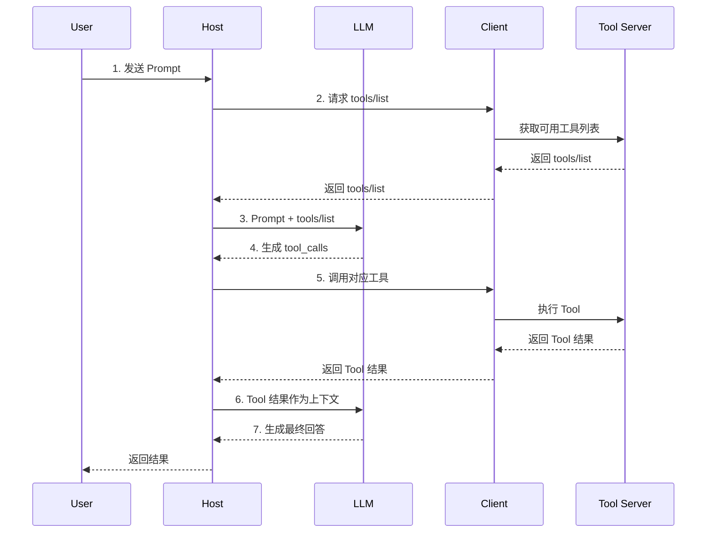

+++
date = '2026-03-09T21:18:26+08:00'
draft = false
title = 'Agent'
tags = ['Agent']
categories = ['人工智能']
summary = '系统梳理 LLM Agent 的经典架构（Planning、Memory、Tools）及演进方向（Multi-Agent、MCP、A2A、Skills）。'
+++

# Agent的经典结构

## Planning

Planning 是 Agent 的"大脑前额叶"——负责将复杂任务拆解为可执行的步骤序列。以下是几种经典且实用的规划范式：

### Chain of Thought (CoT)

**核心思想：** 让 LLM 逐步推理，而不是直接输出最终答案。通过在 Prompt 中加入 "Let's think step by step" 等引导语，迫使模型展示中间推理过程。

- **Zero-shot CoT**：无需示例，仅靠指令触发逐步思考。
- **Few-shot CoT**：在 Prompt 中给出带推理链的示例，模型模仿其格式进行推理。

**实现示例：**

Zero-shot CoT 只需在 Prompt 末尾追加一句引导语：

```text
Q: 一个书店有37本书，又进货了25本，卖出了19本，现在有多少本？
A: Let's think step by step.
```

LLM 输出：

```text
1. 书店最初有 37 本书。
2. 进货 25 本后：37 + 25 = 62 本。
3. 卖出 19 本后：62 - 19 = 43 本。
答案：43本。
```

Few-shot CoT 则在 Prompt 中预置带推理链的 QA 示例，模型自动模仿格式：

```text
Q: 小明有5个苹果，给了小红2个，又买了3个，现在有几个？
A: 小明最初有5个，给了2个剩5-2=3个，又买3个变成3+3=6个。答案是6。

Q: 一个班有28人，转来5人，转走3人，现在有多少人？
A:
```

**优点：** 简单有效，显著提升数学、逻辑等需要多步推理的任务表现。

### Tree of Thoughts (ToT)

**核心思想：** 将 CoT 从单链扩展为树状搜索。在每一步生成多个候选"思考分支"，然后通过评估函数（LLM 自评或启发式）对分支打分，运用 BFS/DFS 策略选择最优路径，必要时回溯（Backtracking）。

**实现示例（以"24点游戏"为例）：**

```python
import itertools

def propose(llm, state: str) -> list[str]:
    """让 LLM 生成多个候选下一步"""
    resp = llm.generate(
        prompt=f"当前状态：{state}\n"
               f"请对剩余数字提出所有可能的下一步运算（每行一个）："
    )
    return resp.strip().split("\n")
    # 例如返回: ["13 - 9 = 4 (剩余 4 4 10)", "10 - 4 = 6 (剩余 9 6 13)", ...]

def evaluate(llm, state: str, candidates: list[str]) -> dict[str, str]:
    """让 LLM 对每个候选分支打分: sure / maybe / impossible"""
    scores = {}
    for c in candidates:
        resp = llm.generate(
            prompt=f"目标：用 +、-、*、/ 让剩余数字得到24。\n"
                   f"当前状态：{state}\n"
                   f"候选下一步：{c}\n"
                   f"判断这条路径能否达到24？回答 sure / maybe / impossible："
        )
        scores[c] = resp.strip()  # "sure" / "maybe" / "impossible"
    return scores

def solve_24_bfs(llm, numbers: list[int]) -> str | None:
    """BFS 搜索：逐层展开，优先展开评分高的分支"""
    queue = [f"数字: {numbers}"]  # 初始状态

    while queue:
        state = queue.pop(0)

        # 1. Propose: 生成候选分支
        candidates = propose(llm, state)

        # 2. Evaluate: LLM 打分
        scores = evaluate(llm, state, candidates)

        for candidate, score in sorted(scores.items(),
                                       key=lambda x: {"sure": 0, "maybe": 1, "impossible": 2}[x[1]]):
            if score == "impossible":
                continue  # 剪枝，跳过不可能的分支

            if "24" in candidate and "=" in candidate:
                return candidate  # 找到解

            queue.append(candidate)  # 加入队列继续展开

    return None  # 搜索完毕，无解

result = solve_24_bfs(llm, [4, 9, 10, 13])
# 搜索过程：
#   层1: propose → ["13-9=4 剩余[4,4,10]", "10-4=6 剩余[9,6,13]", ...]
#         evaluate → {... "10-4=6": "sure"}  ← 优先展开
#   层2: propose → ["13-9=4 剩余[6,4]", "9-6=3 剩余[3,13]", ...]
#         evaluate → {"13-9=4 剩余[6,4]": "sure", "9-6=3": "impossible"}
#   层3: propose → ["6*4=24 ✅"]
```

关键在于每步都让 LLM **生成多个候选 → 自我评估 → 选择性展开**，而不是一条路走到底。

**适用场景：** 需要探索和回溯的复杂规划问题，如创意写作、数学证明、博弈推理。

### ReAct (Reasoning + Acting)

**核心思想：** 将**推理（Thought）** 和 **行动（Action）** 交替执行。Agent 在每一轮先思考当前状态和下一步计划，然后调用外部工具执行动作，再根据工具返回的**观察（Observation）** 继续推理，形成 `Thought → Action → Observation` 的循环。

```text
Thought: 用户问的是今天北京的天气，我需要调用天气API。
Action: call_weather_api(city="北京")
Observation: 晴，25°C，东风3级。
Thought: 我已经拿到了天气信息，可以回复用户了。
Answer: 今天北京天气晴朗，气温25°C，东风3级。
```

**优点：** 让 LLM 与外部世界交互时具备可解释的推理链，大幅减少幻觉。这是当前主流 Agent 框架（LangChain、AutoGPT 等）的基础范式。

### Reflexion

**核心思想：** 在 ReAct 的基础上加入**自我反思**机制。Agent 执行任务后，会对结果进行评估，如果失败则生成一段"反思总结"（verbal reinforcement），存入短期记忆，在下一轮重试时参考这段反思来避免重复犯错。

```text
Trial 1 → 失败
Reflection: "我在第3步错误地假设了X，下次应该先验证X的前提条件。"
Trial 2 → 参考 Reflection → 成功
```

**实现示例（以代码生成任务为例）：**

```python
def reflexion_loop(task, max_trials=3):
    reflections = []  # 累积的反思记忆

    for trial in range(max_trials):
        # 1. Actor：生成代码（参考历史反思）
        code = llm.generate(
            prompt=f"任务：{task}\n历史反思：{reflections}\n请生成代码："
        )

        # 2. Evaluator：运行单元测试
        test_result = run_tests(code)

        if test_result.passed:
            return code  # 成功，退出

        # 3. Self-Reflection：失败时生成反思
        reflection = llm.generate(
            prompt=f"代码：{code}\n测试结果：{test_result.errors}\n"
                   f"请分析失败原因并总结教训："
        )
        # reflection: "我忽略了输入为空列表的边界情况，下次应先处理空输入。"

        reflections.append(reflection)  # 存入短期记忆

    return None  # 多次重试仍失败
```

关键在于每次失败后生成的 **自然语言反思** 会作为上下文传入下一轮，引导 Agent 避开已知的坑。

**优点：** 不修改模型权重，仅靠自然语言反馈实现"自我进化"，显著提升多轮任务的成功率。

### Plan-and-Solve

**核心思想：** 先制定完整计划，再逐步执行。与 ReAct 的"边想边做"不同，Plan-and-Solve 要求 Agent 在动手之前先输出一个完整的、编号明确的行动计划，然后按计划逐步执行。

**实现示例：**

Prompt 模板分两阶段——先让 LLM 输出计划，再逐步执行：

```text
# 阶段一：制定计划

User: 帮我分析这份CSV销售数据，找出销售额最高的产品类别，并生成可视化图表。

Assistant（Plan）:
计划如下：
1. 读取CSV文件，检查数据格式和字段。
2. 按产品类别分组，计算每个类别的销售额总和。
3. 对结果降序排列，找出TOP类别。
4. 使用matplotlib生成柱状图并保存。

# 阶段二：逐步执行

执行步骤1: 读取CSV...
结果: 文件包含3列 [product_category, quantity, price]，共10000行。

执行步骤2: 按类别聚合...
结果: {电子产品: 580万, 服装: 320万, 食品: 210万, ...}

执行步骤3: 排序...
结果: 销售额最高的类别是「电子产品」，总计580万。

执行步骤4: 生成图表...
结果: 图表已保存至 output/sales_by_category.png。
```

与 ReAct 的区别：Plan-and-Solve **先规划全局再执行**，而 ReAct 是**边推理边行动**。前者适合步骤明确、依赖清晰的任务；后者更适合需要动态应变的开放场景。

**适用场景：** 步骤间有强依赖关系的任务，如多步数据处理流水线、复杂的代码重构。

## Memory

### Short-term Memory

短期记忆对应的是 LLM 的上下文窗口（Context Window）。当前对话中的所有消息——用户输入、模型输出、工具调用结果——都会作为 Prompt 的一部分送入模型，这就是 Agent 的"工作记忆"。

**核心限制：** 上下文窗口有固定的 Token 上限（如 GPT-4 Turbo 为 128K tokens）。一旦对话内容超出窗口大小，最早的消息会被截断丢失。

**常见应对策略：**

- **滑动窗口（Sliding Window）**：只保留最近 N 轮对话，丢弃更早的内容。简单但会丢失关键上下文。
- **摘要压缩（Summarization）**：让 LLM 对历史对话生成摘要，用摘要替换原始消息，节省 Token 的同时保留核心信息。
- **关键信息提取（Key-Value Extraction）**：从历史对话中提取结构化的关键事实（如用户偏好、已确认的参数），以压缩格式保留在上下文中。

### Long-term Memory（以mem0为例）

#### Mem0 是什么？

**Mem0 本质上是一个“由大模型驱动的、针对非结构化数据的状态机引擎”。** 传统的 RAG（检索增强生成）是“只读不改”的（Append-only），而 Mem0 解决的是记忆的 **CRUD（增删改查）和自我迭代**。

#### 1. 核心工作流：一次 `add()` 背后发生了什么？

当你调用 `m.add("我今天从北京搬到了上海")` 时，系统底层并不是直接把它塞进向量数据库，而是走了一个极其复杂的 **ETL + 状态判断**流水线：

- **步骤一：意图与实体抽取 (Extraction)** Mem0 会在后台先悄悄调用一次 LLM（通常是一个小模型，为了省钱和速度），把你的非结构化文本转化为结构化的 KV 或 JSON。比如提取出：`主体: User, 动作: 搬家, 旧地点: 北京, 新地点: 上海`。
  
- **步骤二：历史召回 (Retrieve History)** 系统拿着提取出来的关键实体，去底层的存储引擎里查：“数据库里有没有关于这个用户‘住址’的历史记录？”
  
- **步骤三：大模型裁判员 (LLM-as-a-Judge)** 如果查到数据库里有一条旧记录是“我住在北京”，Mem0 会把新输入和旧记录同时交给 LLM，让 LLM 做一次逻辑判断（路由）。LLM 会决定执行以下哪种操作：
  
    - **ADD（新增）**：如果这是个全新的信息（比如“我喜欢吃苹果”），直接插入。
      
    - **UPDATE（更新）**：如果发生了状态变更，LLM 会生成更新指令，把“住在北京”的记忆覆盖为“住在上海”。
      
    - **DELETE（逻辑删除/归档）**：对于已经失效的记忆进行丢弃。
    
- **步骤四：持久化落库 (Persistence)** 最终，只有经过这套“思考”清洗后的干净数据，才会被真正写入底层的存储引擎。
  

#### 2. 混合存储引擎：不只是 VectorDB

Mem0 能做到精准回忆，是因为它在底层做了“三库合一”的设计：

- **向量层 (Vector Store)**：比如 Qdrant、Milvus 或 Chroma。负责存储记忆的文本 Embedding，用来做模糊的语义相似度检索（比如用户说“给我推荐点水果”，系统能召回“用户喜欢吃苹果”的记忆）。
  
- **图数据库层 (Graph Database)**：这是 Mem0 进阶版最硬核的地方。它用类似 Neo4j 的技术来存储实体之间的关系（Entity-Relationship）。比如构建一棵树：`用户 -> 拥有技能 -> Java -> 掌握框架 -> Spring Boot`。当问题涉及到复杂逻辑推理时，图数据库比单纯的向量检索准得多。
  
- **元数据层 (Relational / KV)**：使用 SQLite 或 Postgres 存储硬性约束数据。比如 `user_id`、`session_id`、`created_at`（创建时间）、`updated_at`（更新时间）。这保证了在多租户高并发场景下，用户 A 绝对不会串接到用户 B 的记忆。
  

#### 3. 记忆的检索与衰减机制 (The Read Path)

当你调用 `m.search()` 时，Mem0 的查找逻辑也比普通 RAG 高级：

- **混合检索 (Hybrid Search)**：它会同时向向量库（查语义关联）和图数据库（查逻辑关系）发起并发查询。
  
- **时间衰减与评分 (Scoring & Decay)**：普通的向量数据库只看“相似度”。但 Mem0 的元数据层记录了时间戳，它会在底层根据时间对记忆进行打分调整。**相似度极高但已经是 3 年前的废旧记忆，权重会被降低；而昨天刚存入的、略微相关的记忆，可能会被优先召回。** 这完美模拟了人类“遗忘曲线”的生物学机制。

## Tools

Tools 是 Agent 与外部世界交互的桥梁——开发者预先定义好的函数，供 LLM 在推理过程中按需调用。

### Function Calling 工作流程

LLM 本身不能执行代码或访问网络，它通过 **Function Calling** 机制间接使用工具：

1. **声明工具**：开发者在请求中以 JSON Schema 格式声明可用工具的名称、描述和参数定义。
2. **模型决策**：LLM 根据用户意图判断是否需要调用工具，如果需要，输出结构化的调用请求（函数名 + 参数）。
3. **宿主执行**：应用程序（宿主）解析模型输出，实际执行对应函数，获取返回结果。
4. **结果回传**：将工具执行结果作为新的消息插入上下文，LLM 基于该结果生成最终回答。


### 常见工具类型

| 类型 | 示例 |
|------|------|
| **信息检索** | 网页搜索、知识库查询、数据库查询 |
| **代码执行** | Python 沙箱、Shell 命令执行 |
| **外部 API** | 天气查询、发送邮件、创建日历事件 |
| **文件操作** | 读写文件、解析 PDF/Excel |
| **多模态处理** | 图像生成（DALL·E）、语音合成（TTS） |

工具的质量直接决定了 Agent 的能力上限——**LLM 负责"想"，Tools 负责"做"**。

# Agent的演进

## Multi-Agent

单个 Agent 能力有限——上下文窗口有限、单一角色容易产生偏见、复杂任务难以在一条推理链中完成。Multi-Agent 的核心思想是 **让多个专长不同的 Agent 协作完成任务**，就像一个团队里有产品经理、架构师、程序员、测试员各司其职。

### 常见协作模式

- **主从模式（Orchestrator-Workers）**：一个主 Agent 负责任务拆解和调度，多个子 Agent 各自执行具体子任务。主 Agent 汇总结果后输出最终答案。
  
- **辩论模式（Debate）**：多个 Agent 就同一问题各自给出答案，然后相互质疑和反驳，经过多轮辩论后收敛到一个更可靠的答案。可以有效减少幻觉。
  
- **流水线模式（Pipeline）**：Agent A 的输出作为 Agent B 的输入，像工厂流水线一样串联处理。适合有明确先后顺序的任务（如：需求分析 → 代码生成 → 代码审查 → 测试）。

### 典型框架

| 框架 | 特点 |
|------|------|
| **CrewAI** | 角色驱动，定义 Agent 的 role、goal、backstory，自动协作 |
| **AutoGen** | 微软出品，支持灵活的多 Agent 对话拓扑 |
| **LangGraph** | 基于图的状态机，精确控制 Agent 间的消息流转 |

## MCP

### 官方定义

MCP（Model Context Protocol，模型上下文协议）是一种用于将 AI 应用程序连接到外部系统的开源**标准**。

### 本质

MCP 是一种约定，只要服务/资源提供者（resources, tools）和 AI 应用程序遵循这个约定，AI 应用程序就可以根据这个约定来访问任意按照这个约定实现的资源/服务。

**类比：** MCP 之于 Agent，就像 USB 之于电脑外设。有了 USB 标准，任何厂商生产的键盘、鼠标、U盘都能即插即用；有了 MCP，任何按此协议实现的工具都能被任何 Agent 直接调用。

### 架构

MCP 采用 **Client-Server 架构**：

- **MCP Host**：AI 应用程序（如 Claude Desktop、IDE 插件），内嵌 MCP Client。
- **MCP Client**：与 MCP Server 建立一对一连接，负责协议通信。
- **MCP Server**：轻量级服务，通过标准化接口暴露以下三类能力：
  - **Tools**：可被 LLM 调用的函数（如搜索、数据库查询、API 调用）。
  - **Resources**：只读的数据源（如文件内容、数据库记录），类似 GET 请求。
  - **Prompts**：预定义的 Prompt 模板，用户可选择使用。

通信方式支持两种传输层：
- **stdio**：基于标准输入输出，适用于本地进程通信。
- **Streamable HTTP**：基于 HTTP + SSE（Server-Sent Events），适用于远程服务。

### 流程



### 作用

MCP 让 tools 的复用成为可能。

如果你自己实现一个 agent，你不需要把各种 tools 自己再写一遍（重复造轮子），直接通过 MCP 复用别人写好的 tools 就行了。

服务提供商只需要按照 MCP 提供服务，用户就可以很方便地使用这个服务。降低服务的接入难度，推动了服务使用。

## A2A

### 官方定义

A2A（Agent-to-Agent）协议是一个开放标准，它实现了 AI agents 之间的无缝通信和协作。它为使用不同框架和由不同供应商构建的代理提供了一种通用语言，从而促进了互操作性并打破了信息孤岛。

### MCP vs A2A

两者互补，解决的是不同层面的问题：

| | MCP | A2A |
|---|---|---|
| **连接对象** | Agent ↔ Tool/数据源 | Agent ↔ Agent |
| **类比** | 一个人使用工具（锤子、扳手） | 两个人之间对话协作 |
| **交互模式** | 请求-响应（调用函数，拿结果） | 任务委托（发出任务，对方自主完成） |
| **对方特征** | 被调用方是确定性的程序 | 对方是自主的、不透明的智能体 |

简单说：**MCP 让 Agent 能用工具，A2A 让 Agent 能找同事。**

### 作用

A2A 让智能体的复用成为可能。

如果自己实现一个 Multi-Agent 系统，需要自己实现各 Sub-Agent，其中可能包含一些通用的 agent。通过 A2A，直接让自己的 agent 与其他 agent 交互，避免重复开发 Sub-Agent。

### 核心概念

- **Agent Card**：一个公开的 JSON 元数据文件（类似于 API 的 OpenAPI Spec），声明 agent 的能力、技能、认证方式等。客户端通过读取 Agent Card 来发现和选择合适的 agent。
- **Task**：A2A 中的基本工作单元。客户端创建一个 Task 发送给远程 agent，Task 有状态流转（submitted → working → completed / failed）。
- **Artifact**：Task 执行过程中产生的输出物（如生成的文件、报告等）。

## Skills

组织有序的文件夹，其中包含指令、脚本和资源，agents 可以动态发现并加载这些文件夹，从而更好地执行特定任务。

### 为什么需要 Skills

Prompt 和 tools 分散在各处，很难复用和组合。Skills 将相关的指令、工具配置、资源文件打包为一个**自包含的能力单元**，agent 可以在运行时按需加载。

### Skill 的典型结构

```text
skills/
  code-review/
    SKILL.md          # 技能说明：何时触发、如何使用
    instructions.md   # 详细指令：代码审查的规则和流程
    checklist.yaml    # 资源文件：审查检查清单
  deploy/
    SKILL.md
    instructions.md
    scripts/
      deploy.sh       # 可执行脚本
```

每个 Skill 文件夹包含一个 `SKILL.md` 描述文件，agent 通过扫描这些描述来决定当前任务需要加载哪些 Skills。这样不同的 agent 可以复用同一套 Skills，就像不同的员工可以参考同一份 SOP 手册。

# 参考资料

- [LLM Powered Autonomous Agents | Lil'Log](https://lilianweng.github.io/posts/2023-06-23-agent/)
- [Function calling | OpenAI API](https://developers.openai.com/api/docs/guides/function-calling)
- [A2A Protocol](https://a2a-protocol.org/latest/)
- [Model Context Protocol](https://modelcontextprotocol.io/docs/getting-started/intro)
- [Equipping agents for the real world with Agent Skills \ Anthropic | Claude](https://claude.com/blog/equipping-agents-for-the-real-world-with-agent-skills)
- [Chain-of-Thought Prompting Elicits Reasoning in Large Language Models](https://arxiv.org/abs/2201.11903)
- [Tree of Thoughts: Deliberate Problem Solving with Large Language Models](https://arxiv.org/abs/2305.10601)
- [ReAct: Synergizing Reasoning and Acting in Language Models](https://arxiv.org/abs/2210.03629)
- [Reflexion: Language Agents with Verbal Reinforcement Learning](https://arxiv.org/abs/2303.11366)
- [Plan-and-Solve Prompting: Improving Zero-Shot Chain-of-Thought Reasoning by Large Language Models](https://arxiv.org/abs/2305.04091)
