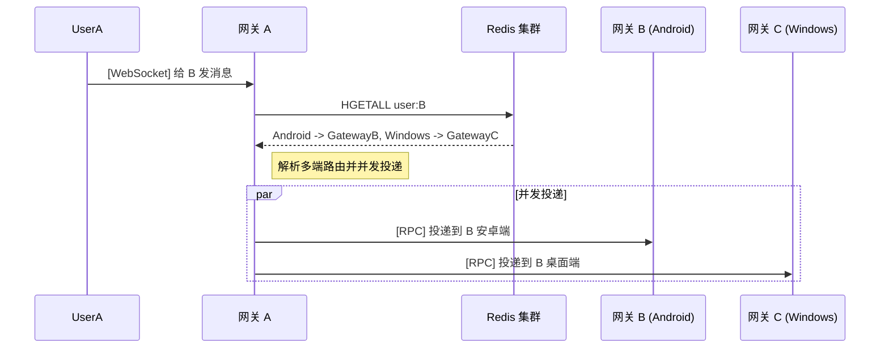
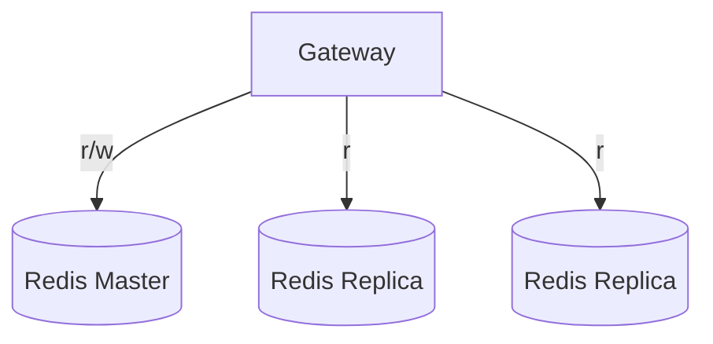
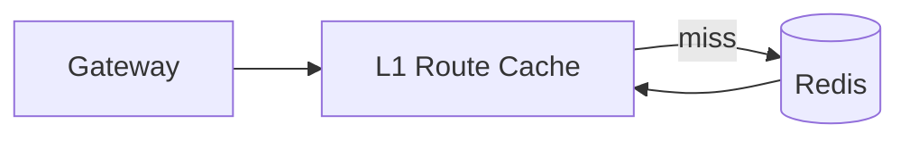
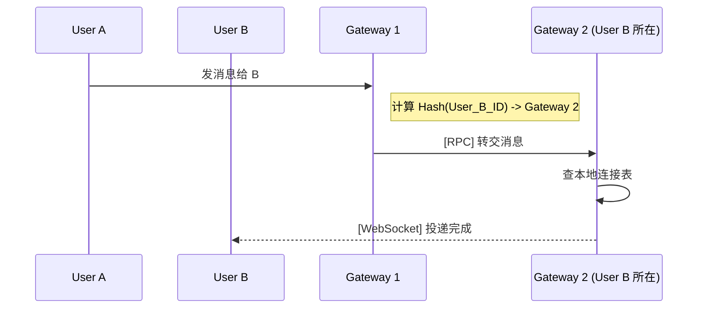

+++
date = '2026-03-13T16:05:30+08:00'
draft = false
title = '分布式 IM 网关路由架构：从集中式 Redis 到连接即路由'
tags = ['IM']
+++

# 分布式 IM 网关路由架构分析与设计

单机 IM 网关阶段，用户与 WebSocket 连接关系维护在本地内存即可，例如使用 `sync.Map` 或 `map[int64]*websocket.Conn + RWMutex`。该模式实现简单、链路短、时延低。

当在线规模持续增长后，单机的 TCP 连接数、CPU 核数与网络带宽会触达上限，系统必须演进为多实例网关集群。此时核心问题变为：

> 用户分散在不同网关实例后，A 给 B 发消息时，如何在毫秒级准确定位 B 所在节点？

本文围绕该问题展开，重点覆盖接入层方案、路由演进路径、集中式 Redis 架构在高规模下的瓶颈，以及“连接即路由”的去中心化方向。

---

## 一、接入层：客户端先连到谁

在内部路由之前，需要先确定客户端第一跳接入方式。主流做法通常分为两类。

### 1. 前置负载均衡接入（Nginx/LVS/SLB）

在网关集群前加反向代理，客户端连接统一入口，再由代理层分发到后端网关。

- 特点：接入结构直观，客户端侧配置简单。
- 问题：代理层同样承担长连接状态，在高并发七层代理场景下会带来明显内存与成本压力。

### 2. Dispatch 服务引流（服务发现 + 直连）

客户端先请求无状态的 HTTP Dispatch 接口。Dispatch 根据网关健康度、负载指标或一致性 Hash 返回目标地址，例如 `192.168.1.100:8080`，然后客户端直接连目标网关。

- 优势：去掉代理层代持长连接成本，网络拓扑更扁平。
- 代价：对调度策略、健康探测和故障转移能力要求更高。

---

## 二、路由策略：A 如何找到 B

接入路径确定后，核心问题回到路由：A 发给 B，A 所在网关如何将消息准确投递到 B 所在网关。

### 演进一：全局广播（Broadcast）

A 所在网关把消息广播给所有网关实例。每个实例检查本地连接表，命中就投递，未命中就丢弃。

- 优点：实现成本低，网关可保持近似无状态。
- 缺点：单聊被放大为 $N$ 份网络与计算开销（$N$ 为网关节点数），规模增大后资源浪费显著。

### 演进二：Redis 集中式路由（Centralized Routing）

为避免广播风暴，可将 Redis 作为全局路由目录：用户登录时写入“用户-网关”绑定，发消息前查询 Redis 后再定向投递。

多端在线场景下，可在同一用户 Key 下按平台保存路由。由于 Redis Hash 的 Field Value 为字符串，通常存储 JSON 字符串。

```javascript
// HASH KEY: "user:10086"
{
  "Android": "{\"gateway_ip\":\"192.168.1.100:8080\",\"login_time\":1710313450}",
  "Windows": "{\"gateway_ip\":\"192.168.1.105:8080\",\"login_time\":1710300000}"
}
```

路由流转如下：



该方案通常可覆盖中小规模系统需求；当目标提升到千万级 DAU 时，瓶颈会逐层显现。

---

## 三、Redis 集中式架构的三道门槛

### 3.1 查询洪峰：单核 QPS 上限

IM 路由访问模型是典型“写少读多”：登录、心跳、下线触发写，消息发送触发读。朴素实现下，基本每发一条消息都会触发一次路由查询。

按常见经验，PCU（峰值同时在线）约为 DAU 的 10% 到 20%。当 DAU 为 1000 万时，晚高峰在线连接约在 100 万到 200 万。叠加心跳、单聊互发、群聊扩散与路由查询后，Redis 压力容易达到 5 万到 15 万 QPS。

Redis 的命令执行路径主要受主线程 CPU 限制。请求接近阈值后，排队会直接表现为消息时延抖动。

常见优化主要有两类：

1. 读写分离：写入走主库，查询分摊到只读副本。
2. 网关 L1 本地缓存：命中本地缓存时不访问 Redis。





但 L1 缓存会引入短时间过期路由问题。

### 3.2 规模海啸：单机容量与 fork 停顿

即使查询压力被分散，数据规模本身仍会成为瓶颈。按每个在线用户约 300 到 500 字节估算：

| 在线用户 | Redis 内存 |
| --- | --- |
| 100 万 | 约 300MB 到 500MB |
| 1000 万 | 约 3GB 到 5GB |
| 3000 万 | 约 9GB 到 15GB |

内存并非唯一问题。Redis 在 `BGSAVE` 或主从全量同步时触发 `fork()`，即便采用 Copy-on-Write，页表复制仍可能造成几十毫秒到上百毫秒停顿。实时通信场景下，这类抖动会直接体现为消息排队。

规模继续提升后，单机网络带宽和 IO 也会成为约束。因此在千万级在线阶段，路由存储通常需要迁移到 Redis Cluster，通过 16384 哈希槽将压力横向拆分到多节点。

### 3.3 状态漂移：分布式一致性难题

当系统同时引入多网关、L1 缓存与 Redis Cluster 后，路由状态天然分散，典型问题是“幽灵路由”。

例如 Redis 仍记录 `User B -> Gateway-X`，但 Gateway-X 已经故障下线。此时消息会持续投递到失效节点，形成黑洞。

另一种情况是缓存滞后：网关 A 缓存里还是“B 在 Gateway-B”，但 B 实际已重连到 Gateway-C。

常见补偿机制可分三层：

1. RPC 失败重查：目标网关返回 `USER_OFFLINE` 或 `ROUTE_ERROR` 后，发送方清缓存并重查 Redis 再投递。
2. 反向索引清理：维护 `Gateway -> Users` 映射，节点下线时批量清理对应路由。
3. TTL 心跳续租：路由记录必须续租，不续租即过期，保证最坏情况下可自动收敛。

| 阶段 | 主要问题 | 常见解法 |
| --- | --- | --- |
| 查询洪峰 | Redis 单核 QPS 瓶颈 | 读写分离 + L1 缓存 |
| 规模海啸 | 单机容量与 fork 停顿 | Redis Cluster |
| 状态漂移 | 路由一致性 | 失败重查 + 反向索引 + TTL |

---

## 四、终极演进：连接即路由（去 Redis）

传统微服务语境中，网关通常要求无状态，状态下沉到 Redis。但在 IM 场景里，长连接本身就是核心状态。

如果“连接在网关内存”与“路由在外部存储”长期分离，一致性修复成本会持续上升。因此“连接即路由”成为高实时通信场景下的重要演进方向。

### 4.1 一致性 Hash 的确定性路由

Dispatch 通过 `Hash(UserID)` 把用户固定映射到某个网关，发送方只需本地计算就能确定目标节点。



- 优势：零路由查询开销，链路直接。
- 风险：扩缩容导致映射变化，可能引发重连抖动；热点用户或热点群易造成局部过载。

### 4.2 Gossip 全局内存路由表

节点间通过 Gossip 传播“用户上下线事件”，让每台网关都持有全量路由表。

- 优势：查路由近似本地内存查询。
- 挑战：事件传播带宽开销大，规模增长后维护成本高，更适合中小规模或粗粒度状态同步。

### 4.3 原生分布式 Actor 模型

在 Erlang/OTP 或 Akka 等 Actor 体系中，进程标识天然携带节点信息。发送消息时可直接面向目标 Actor，跨节点路由与传输由运行时处理。

```erlang
send(TargetPid, {chat_message, "Hello World"}).
```

- 优势：分布式通信语义内建，一致性与容错上限高。
- 约束：技术栈门槛高，团队建设与生态配套成本较高。

---

## 五、如何做架构取舍

该演进路径不存在通用银弹，选型需要与业务阶段和目标指标匹配。

1. 中小到中大型规模：`Redis + 读写分离 + L1 缓存` 通常具备较高工程性价比。
2. 千万级在线目标：需要系统化建设 `Redis Cluster + 补偿机制 + 强调度能力`。
3. 极致实时通信场景：可评估“连接即路由”，以更高架构复杂度换取更低时延与更强吞吐。

本质上，这不是某一种中间件的胜负，而是“状态放在哪里、怎样收敛一致性、如何控制故障半径”的持续权衡。

落地选型可归结为三类约束的平衡：业务规模、时延目标与系统复杂度。
