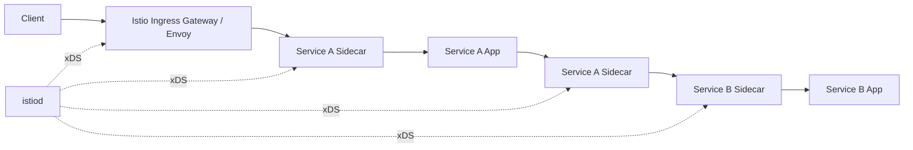

+++
date = '2026-07-19T20:30:00+08:00'
draft = false
title = 'Istio 流量管理教程'
tags = ['Istio', 'Kubernetes', 'Service Mesh']
+++

# Istio 流量管理教程

## 适用范围

本文基于 Istio 1.30.3 官方文档，说明 Sidecar 模式下的流量管理模型和核心 API。重点是理解 Istio 如何在不修改业务代码的前提下控制服务间流量。

本文覆盖：

- `Gateway`：网格边缘的入站或出站代理入口。
- `VirtualService`：流量匹配、路由、超时、重试、故障注入、镜像。
- `DestinationRule`：服务子集、负载均衡、连接池、熔断、异常实例剔除、TLS 策略。
- `ServiceEntry`：把网格外服务加入 Istio 服务注册表。
- `Sidecar`：限制 Envoy Sidecar 的入站端口和出站可见服务范围。
- 数据面排障思路：从路由、cluster、endpoint、listener 四类 Envoy 配置定位问题。

本文不覆盖 Istio 安装、Bookinfo 部署、Ambient 模式、授权策略、Telemetry API、多集群和生产发布流程。

## 流量管理模型

Sidecar 模式下，每个业务 Pod 注入一个 Envoy 容器。业务进程仍然访问 Kubernetes Service 或外部域名，真实转发行为由 Envoy 根据 Istio 配置决定。`istiod` 负责监听 Kubernetes 和 Istio 配置资源，把它们转换为 Envoy xDS 配置，并下发给数据面代理。



典型 HTTP 调用路径：

```text
client
  -> ingressgateway Envoy
  -> service-a sidecar inbound listener
  -> service-a container
  -> service-a sidecar outbound listener
  -> service-b cluster
  -> selected service-b endpoint sidecar inbound listener
  -> service-b container
```

Istio 流量管理的关键抽象是把“调用方看到的 host”和“最终被访问的 workload”解耦：

- 调用方仍然访问 `reviews.default.svc.cluster.local`。
- `VirtualService` 决定这个 host 的请求如何匹配、转发、重写、重试或注入故障。
- `DestinationRule` 决定这个 host 背后的版本子集、连接池、负载均衡和异常实例处理。
- Envoy 最终把配置转换为 listener、route、cluster、endpoint 四类运行时对象。

## 核心资源关系

| 资源 | 作用位置 | 核心字段 | 配置结果 |
|---|---|---|---|
| `Gateway` | Ingress/Egress 网关 Envoy | `selector`、`servers`、`hosts`、`port`、`tls` | 配置边缘代理监听端口、协议和 TLS |
| `VirtualService` | Sidecar Envoy 或 Gateway Envoy | `hosts`、`gateways`、`http`、`tcp`、`tls` | 配置匹配条件和路由动作 |
| `DestinationRule` | 路由完成后的目标服务 | `host`、`subsets`、`trafficPolicy` | 配置服务版本、负载均衡、连接池、熔断、TLS |
| `ServiceEntry` | Istio 服务注册表 | `hosts`、`ports`、`location`、`resolution`、`endpoints` | 把外部服务或 VM 纳入网格流量管理 |
| `Sidecar` | 指定 namespace 或 workload 的 Envoy | `workloadSelector`、`ingress`、`egress` | 裁剪代理可见服务和监听配置 |

`VirtualService` 决定“请求如何路由”。`DestinationRule` 决定“路由到目标后如何连接目标”。如果 `VirtualService` 引用了 `subset`，对应 `DestinationRule` 必须定义该 `subset`。

生产配置建议使用完整 FQDN，例如 `reviews.default.svc.cluster.local`。短名称 `reviews` 会按 `VirtualService` 所在 namespace 解析，跨 namespace 时容易指向错误服务。

## Gateway

`Gateway` 用来配置运行在网格边缘的 Envoy。它只声明监听端口、协议、域名和 TLS，不直接定义业务路由。HTTP 路由由绑定到该 Gateway 的 `VirtualService` 完成。

```yaml
apiVersion: networking.istio.io/v1 # 使用 Istio networking v1 API。
kind: Gateway                      # 声明资源类型为 Gateway，用于配置网格边缘 Envoy。
metadata:                          # Kubernetes 资源元数据。
  name: bookinfo-gateway           # Gateway 资源名称，VirtualService 会通过该名称绑定它。
spec:                              # Gateway 的期望配置。
  selector:                        # 选择哪些网关工作负载加载这份配置。
    istio: ingressgateway          # 匹配 label 为 istio=ingressgateway 的 Ingress Gateway Pod。
  servers:                         # 定义一个或多个对外监听入口。
  - port:                          # 当前监听入口的端口配置。
      number: 80                   # Envoy 对外监听 80 端口。
      name: http                   # 端口名称，通常要能表达协议语义。
      protocol: HTTP               # 按 HTTP 协议处理入站流量。
    hosts:                         # 当前 server 接受的 Host 或 TLS SNI 列表。
    - bookinfo.example.com         # 只接受 Host 为 bookinfo.example.com 的请求。
```

关键点：

- `selector` 选择具体的网关 Pod，通常匹配 Ingress Gateway 的 label。
- `servers.port` 定义 Envoy 对外监听端口。
- `servers.hosts` 限制该监听器接受哪些 HTTP Host 或 TLS SNI。
- HTTPS 入口需要在 `servers.tls` 中配置证书模式、密钥引用和 TLS 参数。

`Gateway` 可以理解为边缘 Envoy 的 listener 配置入口。没有绑定 `VirtualService` 时，请求能进入网关，但不会有业务路由。

## VirtualService

`VirtualService` 是 Istio 流量管理的中心资源。它把一个或多个 host 上的请求，按协议、路径、header、权重等条件转发到目标服务。

```yaml
apiVersion: networking.istio.io/v1                  # 使用 Istio networking v1 API。
kind: VirtualService                                # 声明资源类型为 VirtualService，用于配置路由规则。
metadata:                                           # Kubernetes 资源元数据。
  name: bookinfo                                    # VirtualService 资源名称。
spec:                                               # VirtualService 的期望配置。
  hosts:                                            # 这组路由规则匹配的目标 host。
  - bookinfo.example.com                            # 匹配外部请求中的 Host: bookinfo.example.com。
  gateways:                                         # 指定这组规则绑定到哪些 Gateway。
  - bookinfo-gateway                                # 绑定到同 namespace 下名为 bookinfo-gateway 的 Gateway。
  http:                                             # HTTP 路由规则列表，按声明顺序匹配。
  - match:                                          # 当前 HTTP 规则的匹配条件。
    - uri:                                          # 第一组 URI 匹配条件。
        exact: /productpage                         # 精确匹配 /productpage。
    - uri:                                          # 第二组 URI 匹配条件。
        prefix: /static                             # 前缀匹配 /static。
    route:                                          # 请求命中 match 后执行转发。
    - destination:                                  # 转发目标。
        host: productpage.default.svc.cluster.local # 目标 Kubernetes Service 的完整域名。
        port:                                       # 目标服务端口。
          number: 9080                              # 转发到 productpage 服务的 9080 端口。
```

核心字段：

- `hosts`：规则适用的目标 host。可以是网关域名，也可以是 Kubernetes Service FQDN。
- `gateways`：规则绑定到哪些 Gateway。未设置时，默认等价于绑定到 Istio 的保留 gateway：`mesh`，也就是作用于 **网格内部 Sidecar 之间的服务调用**。
- `http`：HTTP 路由规则列表，按声明顺序匹配。
- `match`：匹配条件，支持 URI、header、query parameter、method、scheme、authority 等。
- `route`：目标服务列表，可配置目标 host、port、subset 和权重。
- `rewrite`、`redirect`：改写或重定向请求。
- `timeout`、`retries`、`fault`、`mirror`：路由级弹性和测试能力。

匹配语义：

- 同一个 `match` 对象内的多个条件是 AND 关系。
- 同一条 HTTP route 下的多个 `match` 对象是 OR 关系。
- `http` 列表按顺序匹配，第一条命中的规则生效。
- 默认路由应放在最后，避免覆盖后续精确匹配。

## DestinationRule

`DestinationRule` 定义访问目标服务时的策略。它不负责匹配请求，而是在 `VirtualService` 已经决定目标 host 后生效。

```yaml
apiVersion: networking.istio.io/v1        # 使用 Istio networking v1 API。
kind: DestinationRule                     # 声明资源类型为 DestinationRule，用于配置目标服务策略。
metadata:                                 # Kubernetes 资源元数据。
  name: reviews                           # DestinationRule 资源名称。
spec:                                     # DestinationRule 的期望配置。
  host: reviews.default.svc.cluster.local # 策略作用的目标服务，建议使用完整 FQDN。
  subsets:                                # 定义该服务下的逻辑版本子集。
  - name: v1                              # 子集名称，VirtualService 可通过 subset: v1 引用。
    labels:                               # 用于从后端 Pod 中筛选该子集成员的标签。
      version: v1                         # 选择带有 version=v1 标签的 Pod。
  - name: v2                              # 子集名称，VirtualService 可通过 subset: v2 引用。
    labels:                               # v2 子集的标签选择条件。
      version: v2                         # 选择带有 version=v2 标签的 Pod。
  - name: v3                              # 子集名称，VirtualService 可通过 subset: v3 引用。
    labels:                               # v3 子集的标签选择条件。
      version: v3                         # 选择带有 version=v3 标签的 Pod。
```

`subset` 是流量管理层的版本分组。Istio 根据 `labels` 从 Kubernetes Endpoint 中选择匹配 workload。例如 `subset: v2` 表示只选择带有 `version: v2` label 的 Pod。

`trafficPolicy` 可以配置目标服务级别的连接策略：

```yaml
trafficPolicy:                       # 目标服务访问策略，可放在服务级或 subset 级。
  loadBalancer:                      # 负载均衡策略。
    simple: LEAST_REQUEST            # 选择当前请求数较少的 endpoint。
  connectionPool:                    # 连接池限制，用于控制客户端 Envoy 到目标服务的并发规模。
    tcp:                             # TCP 层连接池配置。
      maxConnections: 100            # 到目标服务的最大 TCP 连接数。
    http:                            # HTTP 层连接池配置。
      http1MaxPendingRequests: 100   # HTTP/1.1 最大等待请求数。
      maxRequestsPerConnection: 1000 # 单个连接最多承载 1000 个请求。
  outlierDetection:                  # 异常实例剔除策略。
    consecutive5xxErrors: 5          # 连续 5xx 错误达到 5 次后判定 endpoint 异常。
    interval: 10s                    # 每 10 秒执行一次异常检测。
    baseEjectionTime: 30s            # 异常 endpoint 的基础剔除时间为 30 秒。
    maxEjectionPercent: 50           # 最多剔除该服务 50% 的 endpoint。
```

关键点：

- `loadBalancer` 控制目标服务内部多个 endpoint 的负载均衡方式。
- `connectionPool` 限制客户端 Envoy 到目标服务的连接池和排队规模。
- `outlierDetection` 根据错误率临时剔除异常 endpoint。
- `trafficPolicy` 可定义在服务级，也可定义在 subset 级；subset 级配置覆盖服务级配置。
- 如果网格启用了严格 mTLS，并且手工覆盖 TLS 行为，通常需要保留 `tls.mode: ISTIO_MUTUAL`。

## 服务版本和灰度路由

Istio 的版本路由由 `VirtualService` 和 `DestinationRule` 配合完成。`DestinationRule` 先定义版本子集，`VirtualService` 再把请求路由到某个子集。

本节示例没有配置 `gateways` 字段，因此默认绑定到 `mesh`，用于控制网格内部 Sidecar 之间访问 `reviews.default.svc.cluster.local` 的流量。如果要让外部请求通过 Ingress Gateway 进入，需要额外定义 `Gateway`，并在 `VirtualService.spec.gateways` 中显式绑定它。

固定路由到单一版本：

```yaml
apiVersion: networking.istio.io/v1              # 使用 Istio networking v1 API。
kind: VirtualService                            # 声明资源类型为 VirtualService。
metadata:                                       # Kubernetes 资源元数据。
  name: reviews                                 # VirtualService 资源名称。
spec:                                           # VirtualService 的期望配置。
  hosts:                                        # 这组规则匹配的目标 host。
  - reviews.default.svc.cluster.local           # 匹配 reviews 服务的集群内完整域名。
  http:                                         # HTTP 路由规则列表。
  - route:                                      # 未配置 match，表示作为默认 HTTP 路由。
    - destination:                              # 转发目标。
        host: reviews.default.svc.cluster.local # 目标服务仍然是 reviews。
        subset: v1                              # 只选择 DestinationRule 中定义的 v1 子集。
```

按请求头路由：

```yaml
apiVersion: networking.istio.io/v1              # 使用 Istio networking v1 API。
kind: VirtualService                            # 声明资源类型为 VirtualService。
metadata:                                       # Kubernetes 资源元数据。
  name: reviews                                 # VirtualService 资源名称。
spec:                                           # VirtualService 的期望配置。
  hosts:                                        # 这组规则匹配的目标 host。
  - reviews.default.svc.cluster.local           # 匹配 reviews 服务的完整域名。
  http:                                         # HTTP 路由规则列表，按顺序匹配。
  - match:                                      # 第一条 HTTP 规则的匹配条件。
    - headers:                                  # 基于请求头匹配。
        end-user:                               # 检查名为 end-user 的 header。
          exact: jason                          # header 值精确等于 jason 时命中。
    route:                                      # 命中 jason 请求后执行转发。
    - destination:                              # 转发目标。
        host: reviews.default.svc.cluster.local # 目标服务为 reviews。
        subset: v2                              # 转发到 reviews 的 v2 子集。
  - route:                                      # 第二条 HTTP 规则没有 match，是默认兜底路由。
    - destination:                              # 默认转发目标。
        host: reviews.default.svc.cluster.local # 目标服务为 reviews。
        subset: v1                              # 未命中前一条规则时转发到 v1 子集。
```

按权重灰度发布：

```yaml
apiVersion: networking.istio.io/v1              # 使用 Istio networking v1 API。
kind: VirtualService                            # 声明资源类型为 VirtualService。
metadata:                                       # Kubernetes 资源元数据。
  name: reviews                                 # VirtualService 资源名称。
spec:                                           # VirtualService 的期望配置。
  hosts:                                        # 这组规则匹配的目标 host。
  - reviews.default.svc.cluster.local           # 匹配 reviews 服务的完整域名。
  http:                                         # HTTP 路由规则列表。
  - route:                                      # 当前规则的多个加权转发目标。
    - destination:                              # 第一个转发目标。
        host: reviews.default.svc.cluster.local # 目标服务为 reviews。
        subset: v1                              # 选择 reviews 的 v1 子集。
      weight: 90                                # 90% 流量进入 v1。
    - destination:                              # 第二个转发目标。
        host: reviews.default.svc.cluster.local # 目标服务仍然为 reviews。
        subset: v3                              # 选择 reviews 的 v3 子集。
      weight: 10                                # 10% 流量进入 v3。
```

权重路由不依赖 Deployment 副本数。副本数影响版本内部 endpoint 数量；`VirtualService` 权重影响版本之间的流量比例。

## URI 匹配和重写

`VirtualService` 可以把同一 host 下的不同路径转发到不同后端，也可以在转发前改写 URI。

```yaml
apiVersion: networking.istio.io/v1              # 使用 Istio networking v1 API。
kind: VirtualService                            # 声明资源类型为 VirtualService。
metadata:                                       # Kubernetes 资源元数据。
  name: bookinfo-api                            # VirtualService 资源名称。
spec:                                           # VirtualService 的期望配置。
  hosts:                                        # 这组规则匹配的目标 host。
  - bookinfo.example.com                        # 匹配外部访问域名 bookinfo.example.com。
  gateways:                                     # 这组规则绑定到哪些 Gateway。
  - bookinfo-gateway                            # 绑定到 bookinfo-gateway。
  http:                                         # HTTP 路由规则列表，按顺序匹配。
  - match:                                      # 第一条 HTTP 规则的匹配条件。
    - uri:                                      # URI 匹配条件。
        prefix: /reviews                        # 匹配所有以 /reviews 开头的请求。
    rewrite:                                    # 转发前执行 URI 改写。
      uri: /                                    # 把上游看到的 URI 改写为 /。
    route:                                      # 改写后执行转发。
    - destination:                              # 转发目标。
        host: reviews.default.svc.cluster.local # 转发到 reviews 服务。
        port:                                   # 目标服务端口。
          number: 9080                          # 使用 reviews 的 9080 端口。
  - match:                                      # 第二条 HTTP 规则的匹配条件。
    - uri:                                      # URI 匹配条件。
        prefix: /ratings                        # 匹配所有以 /ratings 开头的请求。
    rewrite:                                    # 转发前执行 URI 改写。
      uri: /                                    # 把上游看到的 URI 改写为 /。
    route:                                      # 改写后执行转发。
    - destination:                              # 转发目标。
        host: ratings.default.svc.cluster.local # 转发到 ratings 服务。
        port:                                   # 目标服务端口。
          number: 9080                          # 使用 ratings 的 9080 端口。
```

路径匹配支持 `exact`、`prefix` 和 `regex`。URI rewrite 发生在 Envoy 转发给上游服务之前，上游服务看到的是改写后的路径。

## 超时和重试

`VirtualService` 可以定义 HTTP route 的整体超时和重试策略。

```yaml
apiVersion: networking.istio.io/v1                          # 使用 Istio networking v1 API。
kind: VirtualService                                        # 声明资源类型为 VirtualService。
metadata:                                                   # Kubernetes 资源元数据。
  name: reviews                                             # VirtualService 资源名称。
spec:                                                       # VirtualService 的期望配置。
  hosts:                                                    # 这组规则匹配的目标 host。
  - reviews.default.svc.cluster.local                       # 匹配 reviews 服务的完整域名。
  http:                                                     # HTTP 路由规则列表。
  - route:                                                  # 当前 HTTP 规则的转发目标。
    - destination:                                          # 转发目标。
        host: reviews.default.svc.cluster.local             # 目标服务为 reviews。
        subset: v2                                          # 只访问 reviews 的 v2 子集。
    timeout: 1s                                             # 当前 route 的整体请求超时为 1 秒。
    retries:                                                # 当前 route 的重试策略。
      attempts: 2                                           # 初始请求失败后最多再重试 2 次。
      perTryTimeout: 300ms                                  # 每次尝试最多等待 300 毫秒。
      retryOn: gateway-error,connect-failure,refused-stream # 这些错误条件会触发重试。
```

参数含义：

- `timeout`：当前 route 的整体 HTTP 请求超时。
- `attempts`：初始请求失败后的最大重试次数，最大请求次数为 `1 + attempts`。
- `perTryTimeout`：每次尝试的超时，包含初始请求。
- `retryOn`：触发重试的错误类型或状态条件。

应用代码中的超时和 Envoy 超时相互独立。实际生效的是更早触发的限制。例如应用调用超时为 `500ms`，`VirtualService.timeout` 为 `2s`，则应用会先结束调用。

重试会放大下游压力。服务已经过载时，过高的重试次数会把局部错误扩散为级联故障。重试策略需要和超时、连接池、熔断阈值一起设计。

## 故障注入

故障注入用于验证调用链的超时、降级和错误处理路径。故障注入规则在客户端侧 Envoy 执行，不需要修改目标服务代码。

延迟注入：

```yaml
apiVersion: networking.istio.io/v1              # 使用 Istio networking v1 API。
kind: VirtualService                            # 声明资源类型为 VirtualService。
metadata:                                       # Kubernetes 资源元数据。
  name: ratings                                 # VirtualService 资源名称。
spec:                                           # VirtualService 的期望配置。
  hosts:                                        # 这组规则匹配的目标 host。
  - ratings.default.svc.cluster.local           # 匹配 ratings 服务的完整域名。
  http:                                         # HTTP 路由规则列表，按顺序匹配。
  - match:                                      # 第一条 HTTP 规则的匹配条件。
    - headers:                                  # 基于请求头匹配。
        end-user:                               # 检查名为 end-user 的 header。
          exact: jason                          # header 值精确等于 jason 时命中。
    fault:                                      # 命中该规则后注入故障。
      delay:                                    # 注入延迟类型故障。
        fixedDelay: 7s                          # 固定延迟 7 秒。
        percentage:                             # 故障注入比例。
          value: 100                            # 100% 命中该规则的请求都会被延迟。
    route:                                      # 延迟之后仍然执行正常转发。
    - destination:                              # 转发目标。
        host: ratings.default.svc.cluster.local # 目标服务为 ratings。
        subset: v1                              # 转发到 ratings 的 v1 子集。
  - route:                                      # 第二条 HTTP 规则没有 match，是默认兜底路由。
    - destination:                              # 默认转发目标。
        host: ratings.default.svc.cluster.local # 目标服务为 ratings。
        subset: v1                              # 默认转发到 ratings 的 v1 子集。
```

HTTP abort 注入：

```yaml
fault:              # 当前 HTTP route 的故障注入配置。
  abort:            # 注入 HTTP abort，而不是延迟。
    httpStatus: 500 # 直接向调用方返回 HTTP 500。
    percentage:     # abort 注入比例。
      value: 100    # 100% 命中该规则的请求都会被 abort。
```

生产环境应限制故障注入的 `percentage`、匹配条件和命名空间范围，避免影响非目标流量。

## 流量镜像

流量镜像把真实请求复制到影子目标，同时仍把主响应返回给原目标。镜像目标的响应不会返回给客户端。

```yaml
apiVersion: networking.istio.io/v1              # 使用 Istio networking v1 API。
kind: VirtualService                            # 声明资源类型为 VirtualService。
metadata:                                       # Kubernetes 资源元数据。
  name: reviews                                 # VirtualService 资源名称。
spec:                                           # VirtualService 的期望配置。
  hosts:                                        # 这组规则匹配的目标 host。
  - reviews.default.svc.cluster.local           # 匹配 reviews 服务的完整域名。
  http:                                         # HTTP 路由规则列表。
  - route:                                      # 主请求的转发目标。
    - destination:                              # 主流量目标。
        host: reviews.default.svc.cluster.local # 主流量访问 reviews 服务。
        subset: v1                              # 主流量进入 v1 子集。
      weight: 100                               # 主流量 100% 转发到 v1。
    mirror:                                     # 流量镜像目标。
      host: reviews.default.svc.cluster.local   # 镜像请求也发送到 reviews 服务。
      subset: v3                                # 镜像请求进入 v3 子集。
    mirrorPercentage:                           # 镜像比例。
      value: 10                                 # 复制 10% 请求到镜像目标。
```

镜像适合验证新版本的处理能力、日志输出和下游兼容性。镜像服务必须保证幂等，或隔离写路径，避免影子请求产生真实业务副作用。

## ServiceEntry

`ServiceEntry` 把网格外部服务加入 Istio 服务注册表，使外部依赖也能使用 Istio 的路由、超时、重试和 TLS 策略。

```yaml
apiVersion: networking.istio.io/v1 # 使用 Istio networking v1 API。
kind: ServiceEntry                 # 声明资源类型为 ServiceEntry，用于注册网格外服务。
metadata:                          # Kubernetes 资源元数据。
  name: external-httpbin           # ServiceEntry 资源名称。
spec:                              # ServiceEntry 的期望配置。
  hosts:                           # 注册到 Istio 服务注册表中的外部 host。
  - httpbin.org                    # 外部服务域名。
  ports:                           # 外部服务暴露的端口列表。
  - number: 80                     # 外部服务端口号。
    name: http                     # 端口名称，表达 HTTP 协议语义。
    protocol: HTTP                 # 该端口使用 HTTP 协议。
  location: MESH_EXTERNAL          # 声明该服务位于网格外部。
  resolution: DNS                  # Envoy 通过 DNS 解析外部服务地址。
---                                # 同一个 YAML 文件中的下一个资源。
apiVersion: networking.istio.io/v1 # 使用 Istio networking v1 API。
kind: VirtualService               # 声明资源类型为 VirtualService，用于给外部服务附加路由策略。
metadata:                          # Kubernetes 资源元数据。
  name: external-httpbin           # VirtualService 资源名称。
spec:                              # VirtualService 的期望配置。
  hosts:                           # 这组规则匹配的目标 host。
  - httpbin.org                    # 匹配前面 ServiceEntry 注册的外部服务域名。
  http:                            # HTTP 路由规则列表。
  - timeout: 2s                    # 调用 httpbin.org 的整体超时为 2 秒。
    route:                         # 命中后执行转发。
    - destination:                 # 转发目标。
        host: httpbin.org          # 目标为外部服务 httpbin.org。
        port:                      # 目标端口。
          number: 80               # 转发到外部服务 80 端口。
```

关键点：

- `location: MESH_EXTERNAL` 表示目标在网格外。
- `resolution: DNS` 表示 Envoy 根据 DNS 解析目标地址。
- `ServiceEntry` 只是把服务注册进 Istio，不等价于完整的出站安全边界。
- 如果网格出站模式为 `REGISTRY_ONLY`，未注册的外部目标会被拒绝。

## Sidecar

默认情况下，Sidecar Envoy 可以看到网格内大量服务。大型网格中，这会增加 Envoy 配置体积、内存占用和 xDS 推送成本。`Sidecar` 资源用于裁剪代理的入站端口和出站服务可见范围。

```yaml
apiVersion: networking.istio.io/v1 # 使用 Istio networking v1 API。
kind: Sidecar                      # 声明资源类型为 Sidecar，用于裁剪 Envoy 配置范围。
metadata:                          # Kubernetes 资源元数据。
  name: default                    # Sidecar 资源名称。
  namespace: default               # 该 Sidecar 配置作用在 default namespace。
spec:                              # Sidecar 的期望配置。
  egress:                          # 出站流量可见范围配置。
  - hosts:                         # 当前出站规则允许访问的服务集合。
    - "./*"                        # 允许访问当前 namespace 下的所有服务。
    - "istio-system/*"             # 允许访问 istio-system namespace 下的所有服务。
```

`"./*"` 表示当前 namespace 下的服务，`"istio-system/*"` 表示 `istio-system` namespace 下的服务。`Sidecar` 是配置裁剪工具，不是安全边界。访问控制需要结合 `AuthorizationPolicy`、Kubernetes `NetworkPolicy`、Egress Gateway 或外部防火墙。

## Envoy 配置映射

理解 Istio 排障时，需要把 Istio API 映射回 Envoy 的四类核心配置：

| Envoy 对象 | 来源 | 说明 |
|---|---|---|
| `listener` | `Gateway`、`Sidecar`、服务端口、协议识别 | 决定 Envoy 监听哪些地址和端口，以及使用哪些 filter chain |
| `route` | `VirtualService` | 决定 HTTP 请求如何匹配、改写、转发、重试、镜像 |
| `cluster` | Kubernetes Service、`DestinationRule`、`ServiceEntry` | 表示上游服务，包含负载均衡、连接池、TLS、熔断等策略 |
| `endpoint` | Kubernetes EndpointSlice、WorkloadEntry、ServiceEntry endpoints | 表示 cluster 后面的真实目标实例 |

常见问题的定位逻辑：

| 现象 | 重点检查 | 典型原因 |
|---|---|---|
| 网关返回 404 | `Gateway` 与 `VirtualService.gateways`、`hosts` 是否匹配 | 请求进入网关，但没有匹配到 route |
| 请求返回 503 | cluster 和 endpoint 是否存在 | 目标服务无可用 endpoint、subset label 不匹配、mTLS 策略不一致 |
| subset 不生效 | `DestinationRule.subsets.labels` 与 Pod label 是否一致 | `VirtualService` 引用了不存在或选不中 Pod 的 subset |
| 规则未命中 | `VirtualService.http` 顺序和 `match` 条件 | 默认规则放得太靠前，精确规则被覆盖 |
| 外部服务不可达 | 是否存在 `ServiceEntry`，出站模式是否为 `REGISTRY_ONLY` | 外部服务未注册，或被出站策略拒绝 |
| 灰度比例异常 | route weight 与各 subset 内 endpoint 数量 | 版本间权重和版本内部负载均衡是两层逻辑 |

## 生产配置检查表

- `VirtualService.spec.hosts` 和 `DestinationRule.spec.host` 使用 FQDN。
- `VirtualService` 的默认路由放在最后。
- 引用 `subset` 前先定义 `DestinationRule`，并确保 subset label 能选中 Pod。
- 应用超时、Envoy route 超时、重试次数和 `perTryTimeout` 有统一预算。
- 熔断阈值基于服务容量、连接池、P99 延迟和错误率设定。
- Gateway `hosts` 避免长期使用 `"*"`，生产入口按域名拆分。
- 外部依赖通过 `ServiceEntry` 注册；需要强制出站治理时再配置 `REGISTRY_ONLY`。
- 大型 namespace 使用 `Sidecar`、`exportTo` 缩小配置分发范围。
- 配置变更需要经过静态分析和数据面同步检查。
- 只在必须扩展 Envoy 原生行为时使用 `EnvoyFilter`，并绑定 Istio/Envoy 版本验证。

## 参考资料

- Istio Traffic Management：https://istio.io/latest/docs/concepts/traffic-management/
- Istio VirtualService Reference：https://istio.io/latest/docs/reference/config/networking/virtual-service/
- Istio DestinationRule Reference：https://istio.io/latest/docs/reference/config/networking/destination-rule/
- Istio Gateway Reference：https://istio.io/latest/docs/reference/config/networking/gateway/
- Istio ServiceEntry Reference：https://istio.io/latest/docs/reference/config/networking/service-entry/
- Istio Sidecar Reference：https://istio.io/latest/docs/reference/config/networking/sidecar/
- Istio Debugging Envoy and Istiod：https://istio.io/latest/docs/ops/diagnostic-tools/proxy-cmd/
