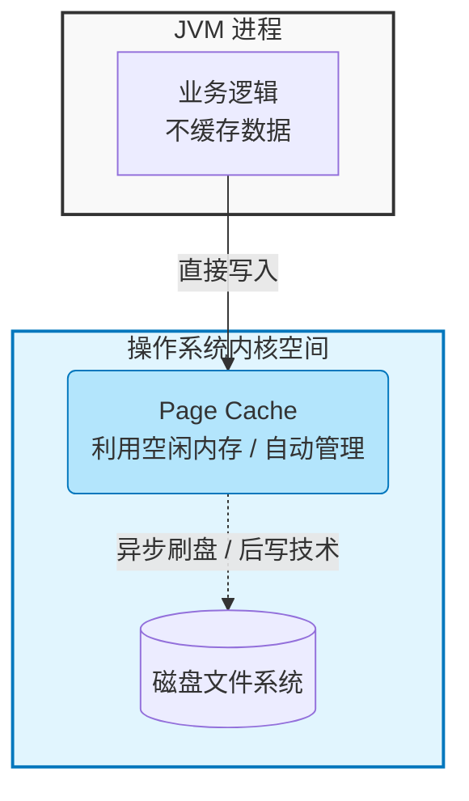
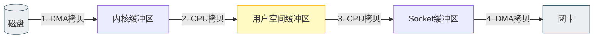
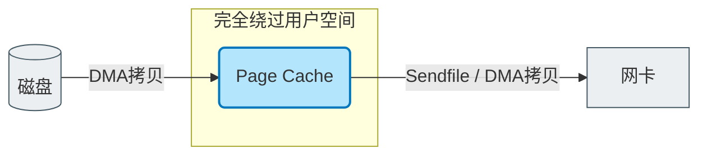
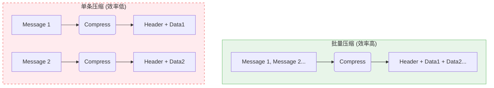
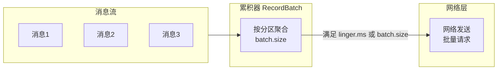
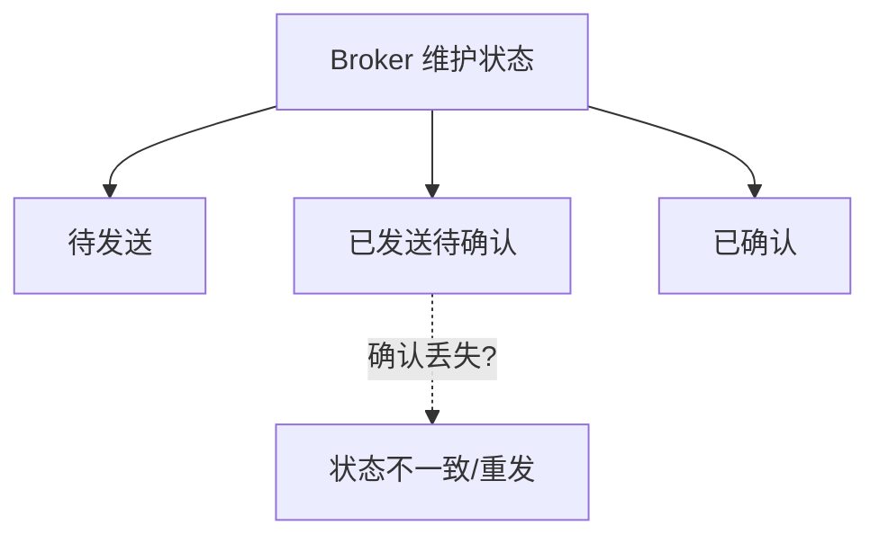
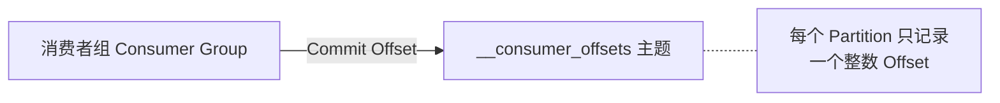
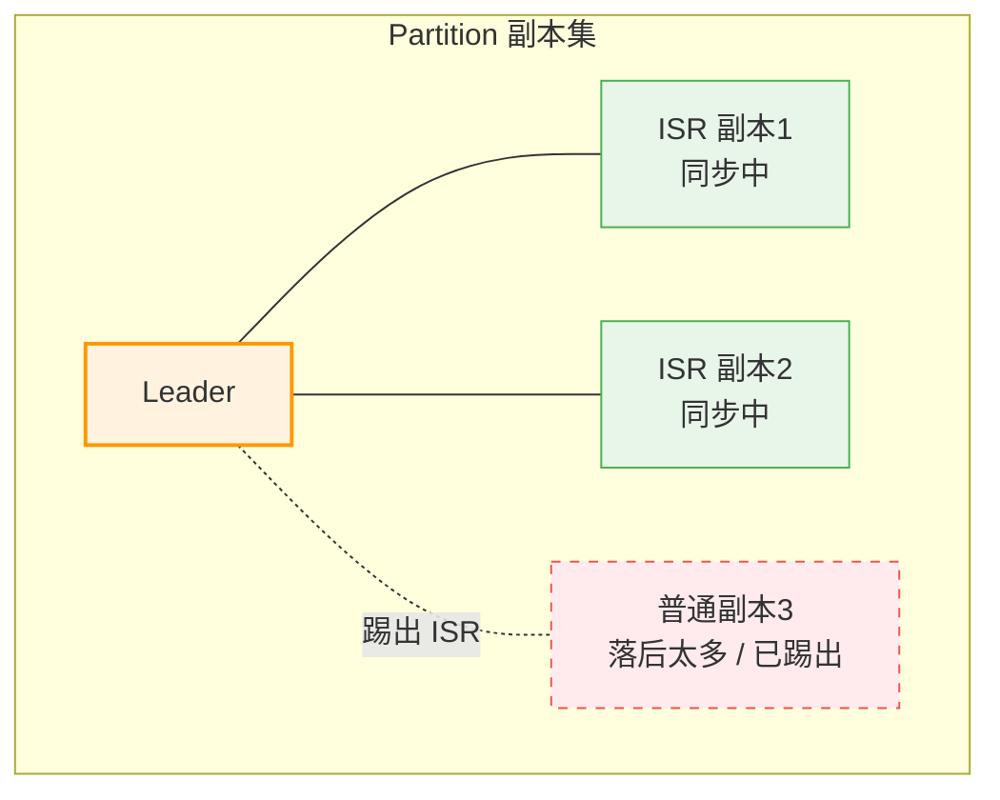
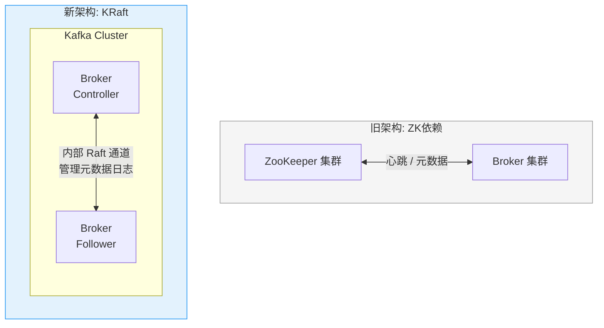
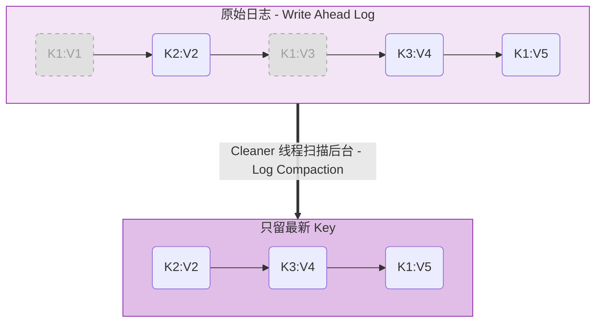

+++
date = '2025-12-24T00:59:41+08:00'
draft = false
title = 'Kafka Design Philosophy'
+++

# 深入理解 Apache Kafka 设计哲学

## 前言

Kafka 是一个分布式流处理平台，但它更像是 **分布式提交日志** 而非传统的消息队列。这种设计哲学贯穿了 Kafka 的每一个核心组件。本文将深入剖析 Kafka 的设计精髓。

---

## 一、存储层设计：为磁盘而生

### 1.1 日志结构存储

Kafka 采用 **只追加写（Append-Only）** 的日志结构，这带来了几个关键优势：

| 特性 | 传统数据库 (B-Tree) | Kafka (Log) |
|------|-------------------|-------------|
| 写入复杂度 | O(log N) | **O(1)** |
| 读取复杂度 | O(log N) | **O(1)** |
| 磁盘访问模式 | 随机 I/O | **顺序 I/O** |
| 适合场景 | 随机查询 | 流式处理 |

### 1.2 顺序 I/O 的威力

对于磁盘来说，O(log N) 并不等同于"接近常数时间"。每次磁盘寻道约需 **10ms**，且无法并行执行。即使少量随机访问也会导致性能急剧下降。

```plain
顺序写磁盘: ~600MB/s
随机写磁盘: ~100KB/s  
差距: 约 6000 倍!
```

### 1.3 拥抱操作系统 Page Cache

Kafka 不在 JVM 堆内存中维护缓存，而是将数据直接写入操作系统的 Page Cache：



**这样做的好处：**
- 避免 JVM GC 问题，堆内存大时 GC 暂停严重
- 重启后缓存依然有效（Page Cache 归操作系统管理）
- 充分利用操作系统的预读（Read-ahead）和后写（Write-behind）优化

---

## 二、网络传输优化：零拷贝

### 2.1 传统数据传输路径



涉及 **4 次数据拷贝** + **2 次系统调用**。

### 2.2 Kafka 的 Sendfile 零拷贝



只有 **1-2 次拷贝**，CPU 几乎不参与数据搬运。

> **关键洞察**：当消费者跟上生产速度时（常见场景），数据直接从 Page Cache 发送到网络，**完全不触及磁盘**。

**⚠️ 特别注意：零拷贝的限制**
零拷贝虽然高效，但在**开启 SSL/TLS 加密**时会失效。
原因：操作系统内核无法处理 TLS 加密算法。数据必须先从 Page Cache 拷贝到用户空间的 JVM 堆内存，由 CPU 进行加密计算后，再拷贝回内核 socket 缓冲区发送。
**路径变为**： `Page Cache → 用户空间(加密) → Socket 缓冲区 → 网卡`
因此，在对性能极度敏感且内网安全的场景下，通常建议在 Kafka 层面通过明文传输，而在负载均衡层（如 LVS/Nginx）或硬件防火墙层处理 SSL。
### 2.3 端到端批量压缩

Kafka 支持将一批消息**分组压缩**后传输：



批量压缩能消除消息间的**重复字段**（如相同的 schema、相似的 key 前缀等），压缩比大幅提升。

---

## 三、生产者设计

### 3.1 分区策略

| 策略 | 适用场景 |
|------|---------|
| **轮询（Round-Robin）** | 均匀分布，无序 |
| **Key 哈希** | 相同 Key 保持顺序 |
| **自定义分区器** | 业务特殊需求 |

### 3.2 批量异步发送



**关键配置**：
- `batch.size`：批次大小阈值
- `linger.ms`：最大等待时间
- 两者任一满足即触发发送

---

## 四、消费者设计

### 4.1 拉模式（Pull-based）

| 推模式 | 拉模式 |
|--------|--------|
| Broker 控制速率 | **消费者自主控制** |
| 容易压垮慢消费者 | 适应不同处理能力 |
| 实时性好 | 通过**长轮询**实现低延迟 |

Kafka 采用拉模式 + 长轮询，兼顾**背压控制**和**低延迟**。

### 4.2 消费位置管理

传统方案的问题：


Kafka 的简化方案：


### 4.3 静态成员身份

通过设置 `group.instance.id`，消费者重启后可以：
- 避免触发 Rebalance
- 继续消费原来负责的分区
- 减少"分区漂移"带来的重复处理

---

## 五、消息语义保证

### 5.1 三种语义

| 语义 | 说明 | 实现复杂度 |
|------|------|----------|
| **At-most-once** | 可能丢失，绝不重复 | 低 |
| **At-least-once** | 绝不丢失，可能重复 | 中 |
| **Exactly-once** | 不丢不重 | 高 |

### 5.2 Exactly-Once 实现

**方案一：事务（Transaction）**
```java
producer.beginTransaction();
producer.send(record1);
producer.send(record2);
producer.commitTransaction();  // 原子提交
```

**方案二：At-Least-Once + 幂等消费**
```java
// 生产者开启幂等
enable.idempotence = true

// 消费端去重
if (!processedIds.contains(message.id)) {
    process(message);
    processedIds.add(message.id);
}
```

事务开销较大，实际生产中常用"幂等消费"作为轻量替代。

---

## 六、复制与容错：ISR 机制

### 6.1 ISR 动态管理



- **落后太多** → 踢出 ISR → 避免拖慢整体
- **追上进度** → 重新加入 ISR
- **Leader 挂掉** → 从 ISR 中选新 Leader

### 6.2 与 Raft 对比

| 特性     | Kafka ISR   | Raft         |
| ------ | ----------- | ------------ |
| 选主机制   | **中心控制器**   | 分布式投票        |
| 最小副本数  | f+1 容忍 f 故障 | 2f+1 容忍 f 故障 |
| 吞吐量    | **更高**      | 相对较低         |
| CAP 倾向 | AP (可配置)    | CP           |

### 6.3 架构演进：弃用 ZooKeeper (KRaft)

在 Kafka 2.8 版本之前，Kafka 严重依赖 ZooKeeper 进行元数据管理和 Controller 选举。新版的**KRaft (Kafka Raft)** 模式彻底移除了 ZooKeeper，Broker 内部通过 Raft 算法选主，无需外部依赖。



---

## 七、日志压缩（Log Compaction）

类似 LSM-Tree 的 Compaction，Kafka 可对**状态变更流**进行合并，只保留每个 Key 的最新值：



**适用场景**：CDC（Change Data Capture）、KV 状态存储

---

## 八、配额管理

Kafka 支持对生产者/消费者设置**吞吐量、CPU等上限**：

```properties
# 限制用户 user1 的生产速率为 10MB/s
quota.producer.default=10485760
```

**目的：避免坏邻居效应**—— 防止某个租户耗尽整个集群资源。

---

## 总结

Kafka 的设计哲学可以归纳为：

1. **拥抱顺序 I/O** —— 日志结构 + 追加写
2. **利用操作系统** —— Page Cache + Sendfile
3. **批量化一切** —— 压缩、发送、拉取
4. **简化状态** —— Offset 而非消息状态
5. **动态容错** —— ISR 弹性伸缩

这些设计使 Kafka 在高吞吐、低延迟和持久性之间取得了绝佳平衡，成为大数据领域的基础设施。

---

## 参考资料

- [Kafka 官方文档 - Design](https://kafka.apache.org/documentation/#design)
