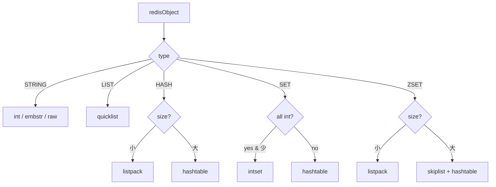
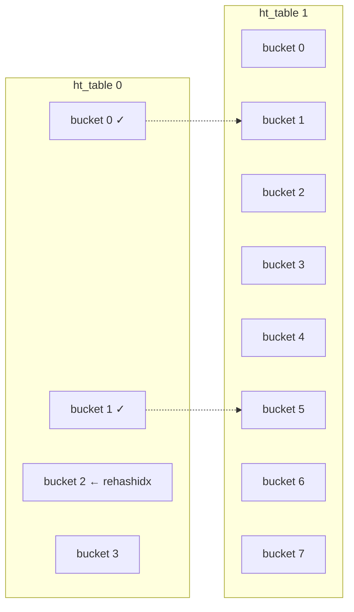

+++
date = '2026-02-12T09:52:26+08:00'
draft = false
title = 'Redis Datastructure'
tags = ['Redis', '数据结构', '源码分析']
categories = ['数据库']
+++

# Redis 数据结构

| 逻辑类型 (Type) | 底层数据结构 (Internal Encoding)     |
| ----------- | ------------------------------ |
| **String**  | int, embstr, raw (SDS)         |
| **List**    | quicklist                      |
| **Hash**    | listpack, hashtable            |
| **Set**     | intset, hashtable              |
| **ZSet**    | listpack, skiplist + hashtable |



每种类型根据数据量自动切换编码：小数据用紧凑结构省内存，大数据切高效结构保性能。

---

## SDS

C 字符串存在三个核心问题：O(N) 获取长度、缓冲区溢出风险、`\0` 截断二进制数据。SDS 逐一解决了这些问题。

```c
struct __attribute__ ((__packed__)) sdshdr8 {
    uint8_t len;         /* 已使用长度，1字节 */
    uint8_t alloc;       /* 总分配长度，1字节 */
    unsigned char flags; /* 低3位是类型，高5位未使用 */
    char buf[];          /* 实际字符串内容 */
};
```

`__packed__` 消除对齐填充。Redis 按长度选用 sdshdr5/8/16/32/64，头开销从 1 到 17 字节不等。

| | C 字符串 | SDS |
|-|---------|-----|
| 长度 | O(N) 遍历 | **O(1)** 直接读 `len` |
| 缓冲区安全 | 手动管理 | API 自动扩容 |
| 二进制安全 | ✗（`\0` 截断） | **✓**（按 `len` 读） |
| 预分配 | ✗ | len<1MB → 2×len；≥1MB → +1MB |
| 惰性释放 | ✗ | 缩短不回收，复用 `alloc` |

embstr 把 redisObject 和 SDS 分配在一块连续内存（≤44B），一次 `malloc`、一次 `free`、缓存行友好。

---

## Listpack

ziplist 的替代方案，消除了级联更新问题。用作 Hash/ZSet/Stream 小数据量时的编码。

```c
/* 伪代码：Listpack 的物理布局 */
struct ListpackLayout {
    uint32_t total_bytes;   // 整个包大小
    uint16_t num_elements;  // 元素个数
    
    // 接下来是 N 个 Entry，紧密排列
    struct Entry entries[] {
        // encoding: 包含类型和数据长度
        // data: 实际数据
        // len: 记录本 Entry 的总长度
    };
    
    uint8_t end_byte; // 固定为 0xFF
};
```

与 ziplist 的关键区别：每个 entry 的 `len` 记录的是**自身**总长度，而非前一节点的长度。ziplist 修改一个节点可能触发后续所有节点的连锁更新（prevlen 字段从 1B 扩展为 5B），listpack 从设计上消除了这一问题。

连续内存 → 零指针开销 → 缓存友好。代价是 O(N) 遍历，所以只用于小数据量。

---

## Quicklist

List 的唯一编码。本质：**listpack 节点组成的双向链表**。

```c
typedef struct quicklist {
    quicklistNode *head;
    quicklistNode *tail;
    unsigned long count;        /* 所有 listpack 中的元素总数 */
    unsigned long len;          /* quicklistNode 节点个数 */
    size_t alloc_size;          /* 总分配内存（字节） */
    signed int fill : QL_FILL_BITS;       /* 单节点填充因子 */
    unsigned int compress : QL_COMP_BITS; /* 两端不压缩的节点深度；0=关闭压缩 */
    unsigned int bookmark_count: QL_BM_BITS;
    quicklistBookmark bookmarks[];
} quicklist;
typedef struct quicklistNode {
    struct quicklistNode *prev;
    struct quicklistNode *next;
    unsigned char *entry;
    size_t sz;             /* entry 占用字节数 */
    unsigned int count : 16;     /* 该 listpack 中的元素个数 */
    unsigned int encoding : 2;   /* RAW==1 或 LZF==2 */
    unsigned int container : 2;  /* PLAIN==1 或 PACKED==2 */
    unsigned int recompress : 1; /* 该节点是否需要重新压缩（临时解压后标记） */
    unsigned int attempted_compress : 1; /* 节点太小，无法压缩 */
    unsigned int dont_compress : 1; /* 禁止压缩（该 entry 稍后会被使用） */
    unsigned int extra : 9; /* 预留位，供未来使用 */
} quicklistNode;
typedef struct quicklistLZF {
    size_t sz; /* LZF 压缩后的字节数 */
    char compressed[];
} quicklistLZF;
```


- `fill`（`list-max-listpack-size`）：正值=单节点最大元素数，负值=字节上限（-2=8KB）
- `compress`（`list-compress-depth`）：中间节点 LZF 压缩，两端保留 N 个不压缩
- List 操作集中在两端（队列/栈语义），中间节点访问频率低，压缩中间节点对常用操作几乎无影响
- `recompress` 位域：临时解压访问后标记，下次操作时重新压缩

---

## Intset

Set 全整数且元素少时的编码。有序整数数组 + 二分查找。

```c
typedef struct intset {
    uint32_t encoding;
    uint32_t length;
    int8_t contents[];
} intset;
```

`contents` 声明为 `int8_t[]` 但实际按 `encoding`（INT16/INT32/INT64）宽度存储，纯粹的内存视图。

### 插入 + 编码升级

插入值超出当前编码范围 → 整个数组升级到更宽编码。只升不降。

```c
/* 向 intset 中插入一个整数 */
intset *intsetAdd(intset *is, int64_t value, uint8_t *success) {
    uint8_t valenc = _intsetValueEncoding(value);
    uint32_t pos;
    if (success) *success = 1;

    /* 必要时升级编码。需要升级时，新值必然在数组最前（< 0）或最后（> 0），
     * 因为它超出了当前编码的表示范围。 */
    if (valenc > intrev32ifbe(is->encoding)) {
        /* 升级操作必定成功，无需设置 *success */
        return intsetUpgradeAndAdd(is,value);
    } else {
        /* 二分查找判断值是否已存在。
         * 若不存在，pos 会被设置为应插入的位置。 */
        if (intsetSearch(is,value,&pos)) {
            if (success) *success = 0;
            return is;
        }

        is = intsetResize(is,intrev32ifbe(is->length)+1);
        if (pos < intrev32ifbe(is->length)) intsetMoveTail(is,pos,pos+1);
    }

    _intsetSet(is,pos,value);
    is->length = intrev32ifbe(intrev32ifbe(is->length)+1);
    return is;
}

/* 将 intset 升级到更宽的编码并插入指定整数 */
static intset *intsetUpgradeAndAdd(intset *is, int64_t value) {
    uint8_t curenc = intrev32ifbe(is->encoding);
    uint8_t newenc = _intsetValueEncoding(value);
    int length = intrev32ifbe(is->length);
    int prepend = value < 0 ? 1 : 0;

    /* 设置新编码并扩容 */
    is->encoding = intrev32ifbe(newenc);
    is = intsetResize(is,intrev32ifbe(is->length)+1);

    /* 从后向前迎移，避免覆盖未迎移的数据。
     * prepend 变量确保在数组开头或末尾留出空位。 */
    while(length--)
        _intsetSet(is,length+prepend,_intsetGetEncoded(is,length,curenc));

    /* 将新值放在数组开头或末尾 */
    if (prepend)
        _intsetSet(is,0,value);
    else
        _intsetSet(is,intrev32ifbe(is->length),value);
    is->length = intrev32ifbe(intrev32ifbe(is->length)+1);
    return is;
}
```

升级关键：**从后向前迁移**，避免覆盖未迁移数据。触发升级的值必然是最大或最小值（超出原编码范围），所以要么 prepend 要么 append。

| 特性 | 说明 |
|------|------|
| 紧凑 | 连续数组，零指针 |
| 自适应 | int16 → int32 → int64 按需升级 |
| 查找 | 有序 + 二分，O(log N) |
| 只升不降 | 删大值不缩编码，避免反复升降抖动 |

---

## Dict

全局键空间、Hash、Set 的底层。拉链法 + **渐进式 rehash**。

```c
struct dict {
    dictType *type;

    dictEntry **ht_table[2];
    unsigned long ht_used[2];

    long rehashidx; /* rehash 进度，-1 表示未进行 rehash */

    /* 注：pauserehash 使用完整的 unsigned，避免迭代器自增时
     * 与其他位域在同一存储单元上产生读-改-写冲突 */
    unsigned pauserehash; /* >0 时暂停 rehash */

    /* 小变量放末尾，优化结构体对齐填充 */
    signed char ht_size_exp[2]; /* 表大小的指数 (size = 1<<exp) */
    int16_t pauseAutoResize;  /* >0 时禁止自动扩缩容 (<0 表示编程错误) */
    void *metadata[];
};

struct dictEntry {
    struct dictEntry *next;  /* 必须为第一个字段 */
    void *key;               /* 必须为第二个字段 */
    union {
        void *val;
        uint64_t u64;
        int64_t s64;
        double d;
    } v;
};

// Set 专用哈希表（无 value）
typedef struct dictEntryNoValue {
    dictEntry *next; /* 必须为第一个字段 */
    void *key;       /* 必须为第二个字段 */
} dictEntryNoValue;
```

`ht_table[2]`：两张哈希表，正常时只使用 `[0]`，rehash 期间 `[1]` 作为新表。`dictEntryNoValue` 专供 Set 使用，省去 value 的 union 开销。`ht_size_exp` 存储指数而非实际大小，减少字段宽度。

### 插入

拉链法：`hash(key)` → bucket 下标 → 头插链表。头插假设：刚写入的 key 更可能被立即访问（时间局部性）。

调用链：`dictAdd` → `dictAddRaw` → `dictFindLinkForInsert`（定位 + 判重 + 顺带 rehash/扩容） → `dictInsertKeyAtLink`（头插）

```c
/* 向哈希表中添加元素 */
int dictAdd(dict *d, void *key __stored_key, void *val)
{
    dictEntry *entry = dictAddRaw(d,key,NULL);

    if (!entry) return DICT_ERR;
    if (!d->type->no_value) dictSetVal(d, entry, val);
    return DICT_OK;
}
dictEntry *dictAddRaw(dict *d, void *key __stored_key, dictEntry **existing)
{
    /* 获取新 key 的插入位置，若 key 已存在则返回 NULL */
    void *position = dictFindLinkForInsert(d, dictStoredKey2Key(d, key), existing);
    if (!position) return NULL;

    /* 必要时复制 key */
    if (d->type->keyDup) key = d->type->keyDup(d, key);

    return dictInsertKeyAtLink(d, key, position);
}
```

### 查找插入位置 + 触发 rehash/扩容

`dictFindLinkForInsert` 是插入的核心：算 hash、遍历链表判重、返回待插入的 bucket 指针。rehash 期间两张表都要查。每次调用顺带推进一步 rehash 和检查扩容。

```c
/* 查找 key 应插入的位置。若 key 不存在，返回待插入的 bucket 指针，
 * 配合 dictInsertKeyAtLink() 使用。若 key 已存在，返回 NULL，
 * 并通过 existing 参数返回已有的 entry。 */
dictEntryLink dictFindLinkForInsert(dict *d, const void *key, dictEntry **existing) {
    unsigned long idx, table;
    dictCmpCache cmpCache = {0};
    dictEntry *he;
    uint64_t hash = dictGetHash(d, key);
    if (existing) *existing = NULL;
    idx = hash & DICTHT_SIZE_MASK(d->ht_size_exp[0]);

    /* 必要时推进一步 rehash */
    _dictRehashStepIfNeeded(d,idx);

    /* 必要时扩容 */
    _dictExpandIfNeeded(d);
    keyCmpFunc cmpFunc = dictGetCmpFunc(d);

    for (table = 0; table <= 1; table++) {
        if (table == 0 && (long)idx < d->rehashidx) continue; 
        idx = hash & DICTHT_SIZE_MASK(d->ht_size_exp[table]);
        /* 检查该 bucket 中是否已存在相同的 key */
        he = d->ht_table[table][idx];
        while(he) {
            const void *he_key = dictStoredKey2Key(d, dictGetKey(he));            
            if (key == he_key || cmpFunc(&cmpCache, key, he_key)) {
                if (existing) *existing = he;
                return NULL;
            }
            he = dictGetNext(he);
        }
        if (!dictIsRehashing(d)) break;
    }

    /* rehash 期间，新插入的 bucket 始终来自新表 ht_table[1] */
    dictEntry **bucket = &d->ht_table[dictIsRehashing(d) ? 1 : 0][idx];
    return bucket;
}
```

`table == 0 && idx < rehashidx` → 这个 bucket 已经迁移到 `ht_table[1]` 了，跳过旧表直接查新表。rehash 期间写入一律进 `ht_table[1]`。

### 渐进式 Rehash

一次性迁移百万级 key 会导致主线程长时间阻塞。Redis 通过将 O(N) 的 rehash 操作分摊到每次 CRUD 中解决这一问题。



1. **触发**：负载因子 ≥1（无子进程）或 ≥ `dict_force_resize_ratio`（有 BGSAVE/BGREWRITEAOF 子进程）
2. **双表并存**：分配 `ht_table[1]`，大小 = 首个 ≥ `used+1` 的 2^n
3. **分摊**：每次 CRUD 迁移若干 bucket
4. **查询**：两张表都查；写入只进 `ht_table[1]`
5. **收尾**：全部迁完，`ht_table[1]` → `ht_table[0]`，释放旧表

```c
static void _dictRehashStepIfNeeded(dict *d, uint64_t visitedIdx) {
    if ((!dictIsRehashing(d)) || (d->pauserehash != 0))
        return;
    /* rehashidx == -1 表示未在 rehash */
    if ((long)visitedIdx >= d->rehashidx && d->ht_table[0][visitedIdx]) {
        /* 当前访问的 bucket 在 ht0 中有数据，就地迎移该 bucket（CPU 缓存友好） */
        _dictBucketRehash(d, visitedIdx);
    } else {
        /* ht0 中该位置无数据，按 rehashidx 顺序推进一步（缓存不友好） */
        dictRehash(d,1);
    }
}
```

优先迁移当前访问的 bucket（利用 CPU 缓存局部性），否则按 `rehashidx` 顺序推进。

### Bucket 迁移

逐个遍历旧 bucket 的链表，重新 hash 到新表。`no_value` 类型（Set）有特殊优化：目标 bucket 为空时直接把 key 编码进 bucket 指针，省掉 `dictEntry` 分配。

```c
/* dictRehash 和 dictBucketRehash 的辅助函数，
 * 将旧表 ht_table[0] 中下标为 idx 的 bucket 中所有 key 迎移到新表 */
static void rehashEntriesInBucketAtIndex(dict *d, uint64_t idx) {
    dictEntry *de = d->ht_table[0][idx];
    uint64_t h;
    dictEntry *nextde;
    while (de) {
        nextde = dictGetNext(de);
        void *storedKey = dictGetKey(de);
        /* 计算在新表中的下标 */
        if (d->ht_size_exp[1] > d->ht_size_exp[0]) {
            const void *key = dictStoredKey2Key(d, storedKey);
            h = dictGetHash(d, key) & DICTHT_SIZE_MASK(d->ht_size_exp[1]);
        } else {
            /* 缩容场景。表大小是 2 的幂，
             * 直接对旧下标做位掩码即可得到新下标 */
            h = idx & DICTHT_SIZE_MASK(d->ht_size_exp[1]);
        }
        if (d->type->no_value) {
            if (!d->ht_table[1][h]) {
                /* 目标 bucket 为空，可以直接将 key 编码进 bucket 指针，
                 * 无需分配 dictEntry。若旧 entry 是分配的，释放其内存 */                
                if (!entryIsKey(de)) zfree(decodeMaskedPtr(de));
                
                de = encodeEntryKey(d, storedKey);
                
            } else if (entryIsKey(de)) {
                /* 当前没有分配 entry 但目标 bucket 非空，需要分配一个 */
                de = createEntryNoValue(storedKey, d->ht_table[1][h]);
            } else {
                dictSetNext(de, d->ht_table[1][h]);
            }
        } else {
            dictSetNext(de, d->ht_table[1][h]);
        }
        d->ht_table[1][h] = de;
        d->ht_used[0]--;
        d->ht_used[1]++;
        de = nextde;
    }
    d->ht_table[0][idx] = NULL;
}
```

缩容时不需要重新 hash：表大小是 2 的幂，新下标 = `idx & 新掩码`，直接位运算。

### 扩容条件

```c
/* 返回 DICT_OK 表示已成功扩容或正在 rehash，无需额外处理。
 * 返回 DICT_ERR 表示未触发扩容（可考虑缩容） */
int dictExpandIfNeeded(dict *d) {
    /* 正在渐进式 rehash，直接返回 */
    if (dictIsRehashing(d)) return DICT_OK;

    /* 空表则初始化为默认大小 */
    if (DICTHT_SIZE(d->ht_size_exp[0]) == 0) {
        dictExpand(d, DICT_HT_INITIAL_SIZE);
        return DICT_OK;
    }

    /* 负载因子达到 1:1 且允许扩容，或负载因子
     * 超过强制扩容阈值，则扩容为原来的两倍 */
    if ((dict_can_resize == DICT_RESIZE_ENABLE &&
         d->ht_used[0] >= DICTHT_SIZE(d->ht_size_exp[0])) ||
        (dict_can_resize != DICT_RESIZE_FORBID &&
         d->ht_used[0] >= dict_force_resize_ratio * DICTHT_SIZE(d->ht_size_exp[0])))
    {
        if (dictTypeResizeAllowed(d, d->ht_used[0] + 1))
            dictExpand(d, d->ht_used[0] + 1);
        return DICT_OK;
    }
    return DICT_ERR;
}
```

三档策略：`RESIZE_ENABLE`（无子进程）负载因子 ≥1 就扩；`RESIZE_AVOID`（有子进程）需要负载因子达到 `dict_force_resize_ratio` 才扩；`RESIZE_FORBID` 完全禁止扩容。有子进程时抑制扩容是为了减少 COW（Copy-On-Write）页面复制开销。

---

## Skiplist

ZSet 大数据量编码。概率性有序结构，O(log N) 增删查，比红黑树实现简单、范围查询天然支持。

```c
/* ZSet 使用的跳跃表实现 */
typedef struct zskiplistNode {
    sds ele;
    double score;
    struct zskiplistNode *backward;
    struct zskiplistLevel {
        struct zskiplistNode *forward;
        /* span 记录当前节点与该层下一个节点之间的距离。
         * 在 L0 层 span 始终为 1（末尾节点为 0），因此复用它存储节点层高，
         * 以便在排名计算时 O(1) 获取节点层数 */
        unsigned long span;
    } level[];
} zskiplistNode;

typedef struct zskiplist {
    struct zskiplistNode *header, *tail;
    unsigned long length;
    int level;
    size_t alloc_size;
} zskiplist;

typedef struct zset {
    dict *dict;
    zskiplist *zsl;
} zset;
```

`zset` 是双索引结构：`zsl` 按 score 有序排列，支持 `ZRANGEBYSCORE`、`ZRANK`（沿路径累加 span）；`dict` 做 member→score O(1) 点查，支持 `ZSCORE`。两者互补。

| 特性 | 说明 |
|------|------|
| 层高 | 随机，P=0.25，期望 ≈1.33 层/节点 |
| 复杂度 | 增删查均 O(log N) |
| span | L0 处复用为节点层高；高层累加得排名 |
| backward | 仅 L0 有，支持 `ZREVRANGE` 逆序 |
| vs 红黑树 | 实现简单、范围查天然支持、并发改造容易 |

---

## 设计原则

| 原则 | 体现 |
|------|------|
| **内存优先** | listpack 零指针、intset 连续数组、SDS `__packed__`、`dictEntryNoValue` |
| **渐进式** | dict rehash 分摊到 CRUD，单线程也不阻塞 |
| **编码自适应** | 小数据→紧凑编码，大数据→高效结构，自动切换 |
| **空间换时间** | ZSet 双索引、SDS 预分配 |
